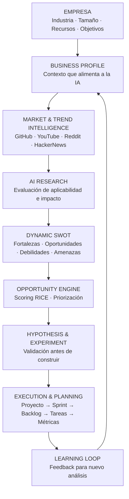

# 01 - Visión del Producto: BOWOL Platform

> **AI Business Copilot & Innovation Operating System**
>
> v1.0 · Última actualización: 2026-01-XX · Autor: Equipo BOWOL · Estado: Aprobado

---

> **CONTEXTO PARA EL PROGRAMADOR**
>
> Este documento es la fuente de verdad sobre **qué es BOWOL, para quién es y por qué existe**. Todo lo demás en `/docs` deriva de aquí.
>
> Léelo completo antes de escribir código. Si en cualquier momento una decisión técnica parece contradecir este documento, para y pregunta. La visión manda sobre la implementación.
>
> Reglas clave que se derivan de este documento:
> - BOWOL no es un buscador de tendencias. Es un sistema operativo de innovación.
> - BOWOL no es un wrapper de ChatGPT. La IA está orquestada por el ciclo Intelligence → Strategy → Execution.
> - Todo lo que construimos debe reducir la distancia entre "tengo una idea" y "está ejecutada, medida y aprendida".
>
> Referencias cruzadas:
> - Arquitectura técnica: `02-ARCHITECTURE.md`
> - Base de datos: `03-DATABASE.md`
> - Contrato de API: `04-API-CONTRACT.md`
> - Estrategia de IA: `05-AI-STRATEGY.md`
> - Frontend y Design System: `07-FRONTEND.md`
> - Roadmap de fases: `09-ROADMAP.md`
> - Glosario de términos: `10-GLOSSARY.md`

---

## 1. El Problema

Las startups, PYMES y equipos de innovación enfrentan cuatro barreras críticas:

### 1.1 Sobrecarga de información sin contexto
Hay cientos de tendencias de IA y tecnología emergente cada mes, pero las empresas no saben cuáles aplican a su industria, tamaño o mercado. El resultado: parálisis, FOMO tecnológico o adopción tardía.

### 1.2 Parálisis por análisis
Tienen ideas pero carecen de una metodología para validarlas. Convierten intuiciones en proyectos costosos sin pasar por hipótesis ni experimentos, y descubren tarde que la idea no tenía tracción.

### 1.3 Desconexión entre estrategia y ejecución
El diagnóstico estratégico (FODA, análisis competitivo, research) suele terminar en un PDF archivado. Nadie lo convierte en tareas concretas asignadas a personas con fechas reales.

### 1.4 Descoordinación operativa
Los equipos operan en 8-12 herramientas aisladas (Notion para docs, Trello para tareas, Google Calendar para fechas, Metricool para redes, ChatGPT para ideas, GitHub para código). El contexto se pierde entre aplicaciones y nadie tiene la foto completa.

**Consecuencia agregada:** el 70% de las startups fracasan por falta de metodología, no por falta de ideas. BOWOL cierra esa brecha.

---

## 2. La Solución: el Ciclo de Innovación Continua

BOWOL no es un buscador de tendencias ni un ChatGPT integrado. Es una plataforma SaaS que **orquesta el ciclo completo** desde la señal hasta el aprendizaje:

**Cada paso está conectado.** El output de un paso alimenta el siguiente. El FODA no vive aislado: se construye con tendencias reales, genera oportunidades con score, se convierte en hipótesis validadas, y termina en tareas asignadas a personas con fechas concretas.

---

## 3. Propuesta de Valor Diferencial

### 3.1 Tagline

> **"Convierte señales del mercado en ejecución medible."**

### 3.2 El ciclo en 5 preguntas

| Pregunta del negocio | Cómo BOWOL la responde |
|---|---|
| ¿Qué está pasando en mi industria? | Trend Intelligence ingesta fuentes reales (GitHub, YouTube, Reddit, HackerNews) y las filtra por relevancia para tu perfil. |
| ¿Me afecta o no? | Correlación automática con tu business profile mediante IA contextual. |
| ¿Qué oportunidad concreta existe? | Opportunity Engine genera iniciativas priorizadas por scoring RICE. |
| ¿Cómo lo ejecutamos? | AI Planner desglosa en hipótesis, experimentos, sprints y tareas asignables. |
| ¿Qué aprendimos? | Cierre del loop con métricas que retroalimentan el siguiente análisis. |

---

## 4. Usuarios Objetivo

### 4.1 Segmentos primarios

| Segmento | Tamaño | Dolores principales | Cómo BOWOL ayuda |
|---|---|---|---|
| **Startups en fase seed/early** | 2-15 personas | Necesitan validar rápido, no pueden contratar consultoría estratégica | FODA + Opportunity Engine + AI Planner reemplazan 3 meses de consultoría |
| **PYMES en digitalización** | 15-100 empleados | No saben por dónde empezar con IA, tienen procesos manuales | Onboarding guiado + tendencias filtradas por industria + roadmap ejecutable |
| **Equipos de innovación corporativa** | 5-20 personas dentro de empresas grandes | Necesitan sistematizar el proceso de ideación y validación | Ciclo completo Intelligence → Execution con trazabilidad y auditoría |
| **Agencias y consultoras** | 5-50 personas | Necesitan multiplicar su capacidad analítica sin contratar más gente | Multi-tenant + IA por cliente + reportes exportables |

### 4.2 Segmentos secundarios (Fase 2+)

- **Freelancers estratégicos** (consultores independientes de innovación).
- **Aceleradoras e incubadoras** (gestionan portfolios de startups).
- **Programas universitarios de emprendimiento**.

### 4.3 Persona ejemplo

> **Ana, 34 años, cofundadora de una startup SaaS B2B en Perú.**
> Equipo de 6 personas. Facturación de $15k MRR. Necesita decidir en qué invertir los próximos 3 meses. Hoy hace research en Twitter, mira YouTube, y arma el roadmap en Notion con su cofundador. Siente que le falta método. BOWOL le da un sistema: su perfil de negocio ya está cargado, recibe 3 tendencias relevantes por semana, las convierte en FODA, prioriza 2 oportunidades y las ejecuta en un sprint de 4 semanas con su equipo.

---

## 5. Diferenciación Competitiva

| Criterio | Notion | Linear | ChatGPT / Claude | Perplexity | Copy.ai | **BOWOL** |
|---|---|---|---|---|---|---|
| Búsqueda de tendencias | ❌ | ❌ | ⚠️ Genérico | ✅ | ❌ | ✅ **Filtrado por negocio** |
| FODA asistido por IA | ❌ | ❌ | ⚠️ Manual | ❌ | ❌ | ✅ **Dinámico + evidencias** |
| Priorización RICE | ❌ | ⚠️ Manual | ❌ | ❌ | ❌ | ✅ **Automática** |
| Hipótesis y experimentos | ❌ | ❌ | ❌ | ❌ | ❌ | ✅ **Con ciclo cerrado** |
| Gestión de sprints y tareas | ⚠️ Básico | ✅ | ❌ | ❌ | ❌ | ✅ **Conectado a estrategia** |
| Multi-tenant para equipos | ⚠️ Workspaces | ✅ | ❌ | ❌ | ❌ | ✅ **Con RLS** |
| Ciclo Intelligence → Execution | ❌ | ❌ | ❌ | ❌ | ❌ | ✅ **Completo** |

**Conclusión:** los competidores atacan piezas aisladas. BOWOL es el único que cierra el ciclo completo desde la señal del mercado hasta la tarea ejecutada, con trazabilidad.

---

## 6. Modelo de Negocio

### 6.1 Planes

| Plan | Precio mensual | Precio anual | Usuarios | Proyectos | Créditos IA/mes | Enfoque |
|---|---|---|---|---|---|---|
| **Free** | $0 | $0 | 1 | 1 | 10 | Exploración |
| **Pro** | $29 | $290 | 5 | 10 | 500 | Freelancers y startups pequeñas |
| **Business** | $99 | $990 | 25 | 100 | 3,000 | PYMES y equipos de innovación |
| **Enterprise** | Personalizado | Personalizado | Ilimitados | Ilimitados | Negociables | Corporativos |

### 6.2 Unit economics objetivo (año 1)

| Métrica | Objetivo |
|---|---|
| CAC (coste de adquisición) | < $80 |
| ARPU (ingreso medio por usuario) | $45/mes |
| LTV (valor de vida) | > $600 |
| LTV / CAC | > 3x |
| Churn mensual | < 5% |

### 6.3 Fuentes de ingreso complementarias (Fase 2+)

- Add-ons: integraciones empresariales (HubSpot, Salesforce) como módulos premium.
- Créditos IA adicionales (más allá del cupo del plan).
- Servicios de onboarding enterprise (implementación asistida).

---

## 7. Ciclo de Vida del Usuario

| Etapa | Objetivo del usuario | Qué hace BOWOL |
|---|---|---|
| **Descubrimiento** | "Necesito entender qué IA aplica a mi negocio" | Landing pública + prueba gratuita 14 días + contenido SEO sobre tendencias |
| **Activación** | "Quiero ver valor en 10 minutos" | Onboarding de 5 pasos → perfil de negocio → 3 tendencias relevantes en el dashboard |
| **Aha moment** | "Esto entiende mi negocio" | Primer FODA generado con IA citando tendencias reales y específicas para su industria |
| **Adopción** | "Esto me sirve para trabajar" | Conversión FODA → oportunidad → hipótesis → sprint → tareas en menos de 30 minutos |
| **Retención** | "Mi equipo lo usa a diario" | Dashboard diario + notificaciones de tendencias nuevas + integración con calendario |
| **Expansión** | "Necesito más usuarios y features" | Upgrade a Pro/Business, invitar miembros, conectar integraciones |
| **Promoción** | "Debería contarlo" | Reportes exportables + caso de éxito compartible + programa de referidos (Fase 3) |

---

## 8. Métricas Clave

### 8.1 North Star Metric

> **Proyectos ejecutados por organización por mes.**

No medimos "usuarios registrados" ni "FODAs generados". Medimos ejecución real: proyectos que terminan con métricas de aprendizaje. Es la única métrica que demuestra que BOWOL está cumpliendo su promesa.

### 8.2 KPIs por etapa

| Etapa | KPI | Objetivo año 1 |
|---|---|---|
| **Adquisición** | Nuevos registros / mes | 500 |
| **Activación** | % que completa onboarding + genera primer FODA en < 24h | > 40% |
| **Retención D7** | % activo a los 7 días | > 50% |
| **Retención D30** | % activo a los 30 días | > 30% |
| **Conversión Free → Pago** | % de Free que pasan a Pro/Business | > 8% |
| **NRR (Net Revenue Retention)** | Ingreso retenido + expansión | > 100% |
| **Churn mensual** | Bajas de pago / total | < 5% |
| **NPS** | Recomendación | > 40 |
| **Tiempo a primer valor** | Onboarding → primer FODA | < 10 minutos |

### 8.3 KPIs técnicos (para el equipo de ingeniería)

| KPI | Objetivo |
|---|---|
| Uptime backend | > 99.5% |
| Latencia p95 API | < 400ms |
| Latencia p95 generación IA | < 8s |
| Coste IA por usuario activo | < $2/mes |
| Cobertura de tests backend | > 70% |
| Lighthouse frontend | > 90 en Performance y Accessibility |

---

## 9. No-Objetivos (lo que BOWOL NO es)

Declarar lo que no somos es tan importante como declarar lo que somos. Previene scope creep y expectativas erróneas.

| No es | Por qué lo aclaramos |
|---|---|
| **Un Notion o wiki empresarial** | No competimos con herramientas de documentación. Si el usuario necesita escribir 50 páginas, no es BOWOL. |
| **Un wrapper de ChatGPT** | La IA está orquestada por el ciclo. No es un chat libre sin contexto ni fuentes. |
| **Una agencia de marketing digital** | No gestionamos campañas ni publicamos por el usuario en Fase 1. Damos inteligencia y planificación. |
| **Un CRM o herramienta de ventas** | No gestionamos pipeline ni contactos comerciales. Se integra con CRMs existentes en Fase 3. |
| **Un reemplazo de Jira o Linear** | Los proyectos y sprints son para validar hipótesis estratégicas, no para gestionar backlog de ingeniería a escala. |
| **Un LMS o plataforma educativa** | No damos cursos. Damos herramientas para que los equipos aprendan haciendo. |
| **Una red social o comunidad** | No hay feed social ni interacción entre usuarios en Fase 1. |
| **Un generador masivo de contenido** | La IA genera análisis y recomendaciones, no 100 posts de Instagram por semana. El content copilot es Fase 2 y con enfoque de calidad. |
| **Una herramienta para individuos sin equipo** | El plan Free existe, pero el valor real está en equipos que necesitan coordinarse. |

---

## 10. Checklist de Validación

Antes de aprobar este documento, verificar:

- [ ] El tagline ("Convierte señales del mercado en ejecución medible") está aprobado por el equipo fundador.
- [ ] Los 4 segmentos primarios están priorizados (¿empezamos por startups o por PYMES?).
- [ ] La tabla de competencia no tiene errores factuales sobre los competidores.
- [ ] Los precios de los 4 planes están validados contra costes reales de infraestructura + IA.
- [ ] El North Star Metric ("Proyectos ejecutados por organización por mes") está aprobado.
- [ ] Los KPIs del año 1 son realistas dado el equipo y el presupuesto actual.
- [ ] La lista de No-Objetivos está consensuada (previene discusiones futuras).
- [ ] Todas las referencias cruzadas a otros docs existen.
- [ ] Sin emojis en ninguna sección.
- [ ] El diagrama Mermaid renderiza correctamente en GitHub.

---

**FIN DEL DOCUMENTO `01-PRODUCT-VISION.md`**