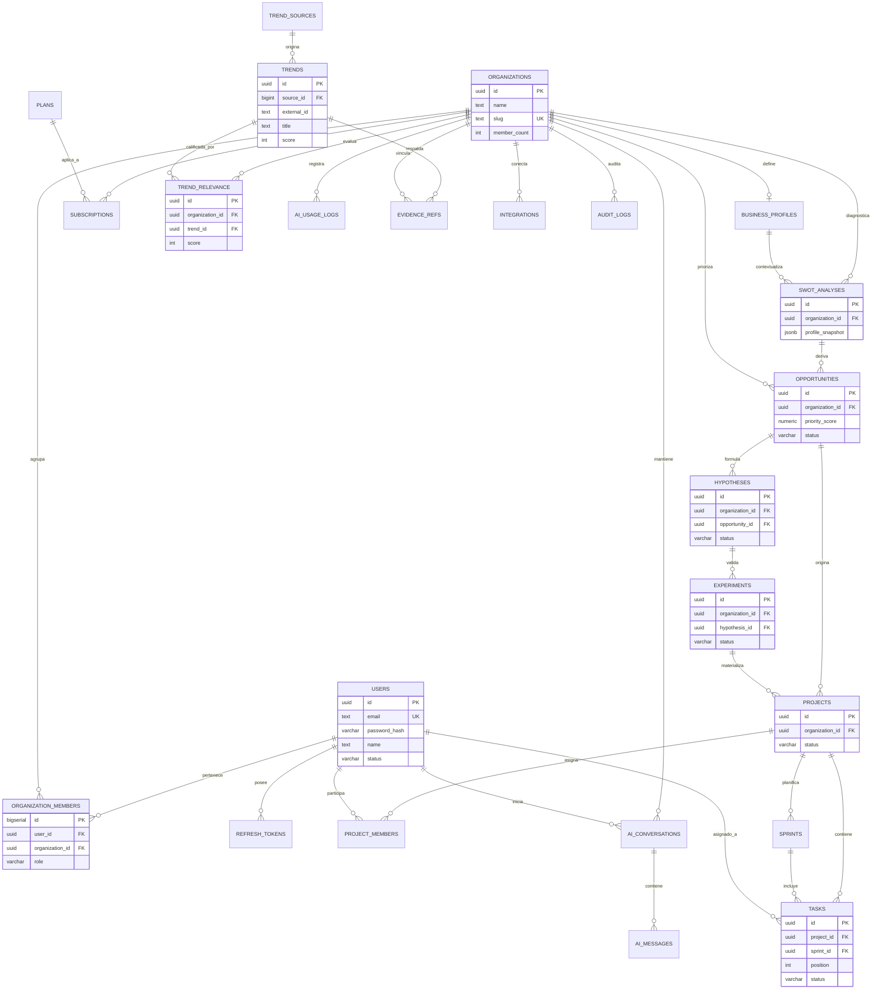

# 03 - Modelo de Base de Datos (v2 — Final)
> **Persistencia Relacional en PostgreSQL 16 con RLS Nativo y Migraciones Flyway**

---

## 1. Cambios Respecto a la v1

| # | Severidad | Cambio | Motivo |
| :---: | :---: | :--- | :--- |
| 🔴 | **1** | **RLS activado desde V2 en todas las tablas con `organization_id`** | Defensa en profundidad; un fallo u omisión de filtro en Hibernate jamás expone datos entre tenants. |
| 🔴 | **2** | **`trends` global + nueva tabla `trend_relevance`** | Elimina duplicación masiva de contenido de mercado; permite escalar a 10M+ de registros sin redundancia. |
| 🔴 | **3** | **Nuevas tablas `hypotheses` + `experiments`** | Cubre de forma nativa el ciclo diferencial: *Estrategia $\rightarrow$ Hipótesis $\rightarrow$ Experimento $\rightarrow$ Tarea*. |
| 🟡 | **4** | **`opportunities.reach_score` añadido** | Cálculo real del algoritmo RICE: $(Reach \times Impact \times Confidence) / Effort$. |
| 🟡 | **5** | **`tasks.position` con incrementos de 1000** | Reordenamiento fluido en tableros Kanban sin requerir reescrituras masivas de filas. |
| 🟡 | **6** | **`swot_analyses.profile_snapshot` JSONB** | Preserva inmutablemente el contexto empresarial exacto que analizó el modelo de IA al generar el FODA. |
| 🟡 | **7** | **Trazabilidad cruzada con `evidence_refs`** | Vinculación N:M entre hallazgos (FODA, Oportunidades, Hipótesis) y las fuentes externas/tendencias originales. |

**Total de tablas del MVP:** 23 tablas de negocio + tabla de auditoría (`audit_logs`).

---

## 2. Diagrama Entidad-Relación (Mermaid)



---

## 3. Estrategia RLS (Row Level Security) desde Día 1

> **Principio de Seguridad:** *"Confía en Hibernate, pero verifica en Postgres."*

1. **Apertura de Transacción y Contexto:** Cada petición HTTP autenticada abre una transacción de base de datos y ejecuta:
   ```sql
   SET LOCAL app.current_organization_id = '<uuid>';
   SET LOCAL app.current_user_id = '<uuid>';
   ```
2. **Defensa Obligatoria:** Todas las tablas que contienen la columna `organization_id` cuentan con:
   - `ENABLE ROW LEVEL SECURITY`
   - `FORCE ROW LEVEL SECURITY` (aplica incluso para el dueño de la tabla si no es superuser).
3. **Política Estándar:**
   ```sql
   USING (organization_id = current_organization_id())
   WITH CHECK (organization_id = current_organization_id())
   ```
4. **Roles sin Privilegios Peligrosos:** El rol de aplicación (`bowol_app`) **no** es superusuario ni posee `BYPASSRLS`.
5. **Aislamiento de Workers:** Los jobs en background (scrapers de tendencias y sincronizadores) utilizan un rol exclusivo (`bowol_worker`) con permisos específicos para escribir tablas globales (`trends`, `trend_sources`) donde `organization_id IS NULL`.
6. **Resultado Criptográfico y Operativo:** Incluso ante una omisión involuntaria de la cláusula `WHERE organization_id = ...` en Spring Data JPA o una inyección HQL, PostgreSQL devuelve **0 filas** ajenas a la organización.

---

## 4. Estrategia de Índices (Resumen por Tabla)

| Tabla | Índices Clave & Constraints | Tipo |
| :--- | :--- | :---: |
| `users` | `uq_users_email` (LOWER(email)) WHERE deleted_at IS NULL<br>`idx_users_name_trgm` (name gin_trgm_ops) | UNIQUE / GIN |
| `organizations` | `uq_organizations_slug`<br>`idx_organizations_name_trgm` (name gin_trgm_ops) | UNIQUE / GIN |
| `organization_members` | `uq_organization_members` (user_id, organization_id)<br>`idx_organization_members_organization` (organization_id, role) | UNIQUE / BTREE |
| `refresh_tokens` | `uq_refresh_tokens_hash` (token_hash)<br>`idx_refresh_tokens_user` (user_id) WHERE revoked_at IS NULL | UNIQUE / BTREE |
| `plans` | `uq_plans_code` (code) | UNIQUE |
| `subscriptions` | `uq_subscriptions_org_active` (organization_id) WHERE status IN ('TRIALING','ACTIVE','PAST_DUE')<br>`uq_subscriptions_stripe` (stripe_subscription_id)<br>`idx_subscriptions_plan` (plan_id) | UNIQUE / BTREE |
| `business_profiles` | UNIQUE (organization_id) | UNIQUE |
| `swot_analyses` | `idx_swot_analyses_org` (organization_id, generated_at DESC) | BTREE |
| `trend_sources` | UNIQUE (code) | UNIQUE |
| `trends` | `uq_trends_source_external` (source_id, external_id)<br>`idx_trends_global_score` (score DESC, fetched_at DESC)<br>`idx_trends_search` GIN (search_vector)<br>`idx_trends_tags` GIN (tags)<br>`idx_trends_metadata` GIN (metadata) | UNIQUE / BTREE / GIN |
| `trend_relevance` | `uq_trend_relevance` (organization_id, trend_id)<br>`idx_trend_relevance_org_score` (organization_id, score DESC, evaluated_at DESC)<br>`idx_trend_relevance_tags` GIN (tags) | UNIQUE / BTREE / GIN |
| `evidence_refs` | `idx_evidence_refs_entity` (entity_type, entity_id)<br>`idx_evidence_refs_trend` (trend_id)<br>`idx_evidence_refs_org` (organization_id, entity_type) | BTREE |
| `ai_conversations` | `idx_ai_conversations_org_user` (organization_id, user_id, updated_at DESC)<br>`idx_ai_conversations_context` (context_type, context_id) | BTREE |
| `ai_messages` | `idx_ai_messages_conversation` (conversation_id, created_at) | BTREE |
| `ai_usage_logs` | `idx_ai_usage_logs_org_created` (organization_id, created_at DESC)<br>`idx_ai_usage_logs_operation` (organization_id, operation, created_at DESC) | BTREE |
| `opportunities` | `idx_opportunities_org_status` (organization_id, status, priority_score DESC NULLS LAST)<br>`idx_opportunities_swot` (swot_analysis_id) | BTREE |
| `hypotheses` | `idx_hypotheses_org_opp` (organization_id, opportunity_id, status)<br>`idx_hypotheses_org_status` (organization_id, status, updated_at DESC) | BTREE |
| `experiments` | `idx_experiments_hypothesis` (hypothesis_id, status)<br>`idx_experiments_org_status` (organization_id, status, start_date DESC NULLS LAST) | BTREE |
| `projects` | `idx_projects_org_status` (organization_id, status) WHERE deleted_at IS NULL<br>`idx_projects_opportunity` (opportunity_id)<br>`idx_projects_experiment` (experiment_id) | BTREE |
| `project_members` | `uq_project_members` (project_id, user_id)<br>`idx_project_members_user` (user_id) | UNIQUE / BTREE |
| `sprints` | `idx_sprints_project_status` (project_id, status, start_date DESC) | BTREE |
| `tasks` | `idx_tasks_project_status` (project_id, status, position)<br>`idx_tasks_sprint` (sprint_id, status)<br>`idx_tasks_assignee` (assignee_id, status) | BTREE |
| `integrations` | `uq_integrations_org_provider` (organization_id, provider)<br>`idx_integrations_org_active` (organization_id) WHERE is_active = TRUE | UNIQUE / BTREE |
| `audit_logs` | `idx_audit_logs_org_created` (organization_id, created_at DESC)<br>`idx_audit_logs_entity` (entity_type, entity_id)<br>`idx_audit_logs_user` (user_id, created_at DESC) | BTREE |

---

## 5. Convenciones de Modelado

- **Nomenclatura:** Tablas en plural con `snake_case` (`business_profiles`, `trend_sources`).
- **Claves Primarias:** UUID v4 con `gen_random_uuid()` para entidades de negocio; `BIGSERIAL` para tablas de cruce de alta frecuencia (`organization_members`, `evidence_refs`, `ai_messages`).
- **Claves Foráneas:** Estrictamente `<singular>_id` con integridad referencial explícita (`ON DELETE CASCADE` / `SET NULL` / `RESTRICT`).
- **Tipos de Datos:**
  - `TIMESTAMPTZ` en lugar de `TIMESTAMP` sin zona horaria.
  - `TEXT` con constraints `CHECK` en lugar de `VARCHAR(n)` arbitrarios o `ENUM` rígidos de Postgres.
  - `JSONB` para snapshots inmutables (`profile_snapshot`), colecciones de configuración y metadatos dinámicos.
- **Prefijos estándar:** `uq_*` (Unique), `idx_*` (Index), `chk_*` (Check constraint), `trg_*` (Trigger).

---

## 6. Roadmap de la Base de Datos

- **MVP (Fase Actual):** 23 tablas de negocio + auditoría, RLS activado en todas las tablas con `organization_id`, triggers de `updated_at`, `member_count` y `search_vector` (Full-Text Search con `unaccent` + `pg_trgm`).
- **Fase 2:** Tablas de presencia digital y marketing: `social_accounts`, `social_metrics`, `content_calendar`, `brand_profiles`, `notifications`, normalización avanzada de `evidence_refs`.
- **Fase 3:** Particionamiento declarativo por rango temporal en `trends` y `ai_usage_logs`, soporte vectorial con `pgvector` para embeddings semánticos y configuración de Read Replicas.

---

## 7. Migraciones Flyway Completas (`V1` a `V14`)

Las migraciones se encuentran ubicadas en:  
`backend/src/main/resources/db/migration/`

### `V1__init_extensions.sql`
```sql
CREATE EXTENSION IF NOT EXISTS "pgcrypto";
CREATE EXTENSION IF NOT EXISTS "pg_trgm";
CREATE EXTENSION IF NOT EXISTS "unaccent";

COMMENT ON EXTENSION "pgcrypto" IS 'UUID v4 fallback en BD';
COMMENT ON EXTENSION "pg_trgm"  IS 'Índices trigram para ILIKE rápido';
COMMENT ON EXTENSION "unaccent" IS 'Búsquedas full-text sin tildes';
```

### `V2__init_roles_and_rls_helpers.sql`
```sql
DO $$
BEGIN
    IF NOT EXISTS (SELECT 1 FROM pg_roles WHERE rolname = 'bowol_app') THEN
        CREATE ROLE bowol_app NOLOGIN NOBYPASSRLS;
    END IF;
    IF NOT EXISTS (SELECT 1 FROM pg_roles WHERE rolname = 'bowol_worker') THEN
        CREATE ROLE bowol_worker NOLOGIN NOBYPASSRLS;
    END IF;
END $$;

CREATE OR REPLACE FUNCTION current_organization_id()
RETURNS UUID
LANGUAGE SQL STABLE
AS $$
    SELECT NULLIF(current_setting('app.current_organization_id', true), '')::uuid
$$;

COMMENT ON FUNCTION current_organization_id() IS 'Devuelve el tenant actual o NULL si no está definido.';
```

### `V3__create_identity.sql`
```sql
CREATE TABLE users (
    id              UUID PRIMARY KEY DEFAULT gen_random_uuid(),
    email           TEXT NOT NULL,
    password_hash   VARCHAR(60) NOT NULL,
    name            TEXT NOT NULL,
    avatar_url      TEXT,
    status          VARCHAR(20) NOT NULL DEFAULT 'ACTIVE',
    last_login_at   TIMESTAMPTZ,
    created_at      TIMESTAMPTZ NOT NULL DEFAULT NOW(),
    updated_at      TIMESTAMPTZ,
    deleted_at      TIMESTAMPTZ,
    CONSTRAINT chk_users_status CHECK (status IN ('ACTIVE','INACTIVE','SUSPENDED','PENDING'))
);

CREATE UNIQUE INDEX uq_users_email
    ON users (LOWER(email))
    WHERE deleted_at IS NULL;

CREATE TABLE organizations (
    id              UUID PRIMARY KEY DEFAULT gen_random_uuid(),
    name            TEXT NOT NULL,
    slug            TEXT NOT NULL,
    logo_url        TEXT,
    industry        TEXT,
    country         CHAR(2),
    size            VARCHAR(20),
    website         TEXT,
    settings        JSONB NOT NULL DEFAULT '{}'::jsonb,
    member_count    INT NOT NULL DEFAULT 0,
    created_at      TIMESTAMPTZ NOT NULL DEFAULT NOW(),
    updated_at      TIMESTAMPTZ,
    deleted_at      TIMESTAMPTZ,
    CONSTRAINT uq_organizations_slug UNIQUE (slug),
    CONSTRAINT chk_organizations_size
        CHECK (size IS NULL OR size IN ('SOLO','MICRO','SMALL','MEDIUM','LARGE','ENTERPRISE')),
    CONSTRAINT chk_organizations_member_count CHECK (member_count >= 0)
);

CREATE INDEX idx_organizations_name_trgm
    ON organizations USING GIN (name gin_trgm_ops)
    WHERE deleted_at IS NULL;

CREATE TABLE organization_members (
    id              BIGSERIAL PRIMARY KEY,
    user_id         UUID NOT NULL REFERENCES users(id) ON DELETE CASCADE,
    organization_id UUID NOT NULL REFERENCES organizations(id) ON DELETE CASCADE,
    role            VARCHAR(30) NOT NULL,
    status          VARCHAR(20) NOT NULL DEFAULT 'ACTIVE',
    joined_at       TIMESTAMPTZ NOT NULL DEFAULT NOW(),
    CONSTRAINT uq_organization_members UNIQUE (user_id, organization_id),
    CONSTRAINT chk_organization_members_role
        CHECK (role IN ('OWNER','ADMIN','MANAGER','MEMBER')),
    CONSTRAINT chk_organization_members_status
        CHECK (status IN ('ACTIVE','INVITED','SUSPENDED'))
);

CREATE INDEX idx_organization_members_organization
    ON organization_members (organization_id, role);

CREATE TABLE refresh_tokens (
    id              BIGSERIAL PRIMARY KEY,
    user_id         UUID NOT NULL REFERENCES users(id) ON DELETE CASCADE,
    token_hash      VARCHAR(64) NOT NULL,
    expires_at      TIMESTAMPTZ NOT NULL,
    revoked_at      TIMESTAMPTZ,
    user_agent      TEXT,
    ip_address      INET,
    created_at      TIMESTAMPTZ NOT NULL DEFAULT NOW(),
    CONSTRAINT uq_refresh_tokens_hash UNIQUE (token_hash)
);

CREATE INDEX idx_refresh_tokens_user
    ON refresh_tokens (user_id)
    WHERE revoked_at IS NULL;
```

### `V4__create_saas.sql`
```sql
CREATE TABLE plans (
    id                  BIGSERIAL PRIMARY KEY,
    code                VARCHAR(30) NOT NULL,
    name                TEXT NOT NULL,
    description         TEXT,
    price_monthly       NUMERIC(10,2) NOT NULL DEFAULT 0,
    price_yearly        NUMERIC(10,2) NOT NULL DEFAULT 0,
    currency            CHAR(3) NOT NULL DEFAULT 'USD',
    features            JSONB NOT NULL DEFAULT '{}'::jsonb,
    ai_credits_monthly  INT NOT NULL DEFAULT 0,
    max_users           INT,
    max_projects        INT,
    is_active           BOOLEAN NOT NULL DEFAULT TRUE,
    created_at          TIMESTAMPTZ NOT NULL DEFAULT NOW(),
    updated_at          TIMESTAMPTZ,
    CONSTRAINT uq_plans_code UNIQUE (code),
    CONSTRAINT chk_plans_prices CHECK (price_monthly >= 0 AND price_yearly >= 0),
    CONSTRAINT chk_plans_credits CHECK (ai_credits_monthly >= 0)
);

INSERT INTO plans (code, name, price_monthly, price_yearly, ai_credits_monthly, max_users, max_projects, features) VALUES
('FREE',       'Free',        0,    0,     10,    1,    1,
 '{"trends_basic":true,"swot":"basic","ai_research":5}'),
('PRO',        'Pro',        29,  290,    500,    5,   10,
 '{"trends_basic":true,"swot":"advanced","ai_research":100,"sprints":true,"calendar":true}'),
('BUSINESS',   'Business',   99,  990,   3000,   25,  100,
 '{"trends_basic":true,"swot":"advanced","ai_research":1000,"sprints":true,"calendar":true,"social":true,"brand":true,"experiments":true}'),
('ENTERPRISE', 'Enterprise',  0,    0,      0, NULL, NULL,
 '{"custom":true,"sso":true,"api":true,"experiments":true}');

CREATE TABLE subscriptions (
    id                      UUID PRIMARY KEY DEFAULT gen_random_uuid(),
    organization_id         UUID NOT NULL REFERENCES organizations(id) ON DELETE CASCADE,
    plan_id                 BIGINT NOT NULL REFERENCES plans(id) ON DELETE RESTRICT,
    status                  VARCHAR(30) NOT NULL DEFAULT 'TRIALING',
    current_period_start    TIMESTAMPTZ NOT NULL,
    current_period_end      TIMESTAMPTZ NOT NULL,
    trial_ends_at           TIMESTAMPTZ,
    canceled_at             TIMESTAMPTZ,
    stripe_subscription_id  TEXT,
    stripe_customer_id      TEXT,
    created_at              TIMESTAMPTZ NOT NULL DEFAULT NOW(),
    updated_at              TIMESTAMPTZ,
    CONSTRAINT chk_subscriptions_status
        CHECK (status IN ('TRIALING','ACTIVE','PAST_DUE','CANCELED','EXPIRED')),
    CONSTRAINT chk_subscriptions_period CHECK (current_period_end > current_period_start)
);

CREATE UNIQUE INDEX uq_subscriptions_org_active
    ON subscriptions (organization_id)
    WHERE status IN ('TRIALING','ACTIVE','PAST_DUE');

CREATE INDEX idx_subscriptions_plan ON subscriptions (plan_id);

CREATE UNIQUE INDEX uq_subscriptions_stripe
    ON subscriptions (stripe_subscription_id)
    WHERE stripe_subscription_id IS NOT NULL;
```

### `V5__create_business.sql`
```sql
CREATE TABLE business_profiles (
    id                      UUID PRIMARY KEY DEFAULT gen_random_uuid(),
    organization_id         UUID NOT NULL UNIQUE REFERENCES organizations(id) ON DELETE CASCADE,
    industry                TEXT,
    size                    VARCHAR(20),
    market                  TEXT,
    goals                   JSONB NOT NULL DEFAULT '[]'::jsonb,
    problems                JSONB NOT NULL DEFAULT '[]'::jsonb,
    tools                   JSONB NOT NULL DEFAULT '[]'::jsonb,
    competitors             JSONB NOT NULL DEFAULT '[]'::jsonb,
    channels                JSONB NOT NULL DEFAULT '[]'::jsonb,
    digital_maturity        SMALLINT,
    ai_maturity             SMALLINT,
    onboarding_completed_at TIMESTAMPTZ,
    created_at              TIMESTAMPTZ NOT NULL DEFAULT NOW(),
    updated_at              TIMESTAMPTZ,
    deleted_at              TIMESTAMPTZ,
    CONSTRAINT chk_business_profiles_maturity CHECK (
        (digital_maturity IS NULL OR digital_maturity BETWEEN 0 AND 100) AND
        (ai_maturity      IS NULL OR ai_maturity      BETWEEN 0 AND 100)
    )
);

CREATE TABLE swot_analyses (
    id                  UUID PRIMARY KEY DEFAULT gen_random_uuid(),
    organization_id     UUID NOT NULL REFERENCES organizations(id) ON DELETE CASCADE,
    business_profile_id UUID REFERENCES business_profiles(id) ON DELETE SET NULL,
    profile_snapshot    JSONB NOT NULL DEFAULT '{}'::jsonb,
    strengths           JSONB NOT NULL DEFAULT '[]'::jsonb,
    weaknesses          JSONB NOT NULL DEFAULT '[]'::jsonb,
    opportunities       JSONB NOT NULL DEFAULT '[]'::jsonb,
    threats             JSONB NOT NULL DEFAULT '[]'::jsonb,
    summary             JSONB,
    ai_provider         VARCHAR(30),
    ai_model_used       VARCHAR(60),
    generated_at        TIMESTAMPTZ NOT NULL DEFAULT NOW(),
    created_at          TIMESTAMPTZ NOT NULL DEFAULT NOW()
);

CREATE INDEX idx_swot_analyses_org
    ON swot_analyses (organization_id, generated_at DESC);

COMMENT ON COLUMN swot_analyses.profile_snapshot IS
    'Copia inmutable del business_profile + contexto usado por la IA al generar este FODA.';
```

### `V6__create_intelligence.sql`
```sql
CREATE TABLE trend_sources (
    id              BIGSERIAL PRIMARY KEY,
    code            VARCHAR(30) NOT NULL UNIQUE,
    name            TEXT NOT NULL,
    base_url        TEXT,
    source_level    CHAR(1) NOT NULL DEFAULT 'B',
    description     TEXT,
    is_active       BOOLEAN NOT NULL DEFAULT TRUE,
    last_synced_at  TIMESTAMPTZ,
    created_at      TIMESTAMPTZ NOT NULL DEFAULT NOW(),
    CONSTRAINT chk_trend_sources_level CHECK (source_level IN ('A','B','C'))
);

INSERT INTO trend_sources (code, name, base_url, source_level) VALUES
('GITHUB',     'GitHub',      'https://api.github.com',                'A'),
('YOUTUBE',    'YouTube',     'https://www.googleapis.com/youtube/v3', 'B'),
('HACKERNEWS', 'Hacker News', 'https://news.ycombinator.com',          'B'),
('REDDIT',     'Reddit',      'https://www.reddit.com',                'B'),
('DEVTO',      'Dev.to',      'https://dev.to',                        'B');

CREATE TABLE trends (
    id              UUID PRIMARY KEY DEFAULT gen_random_uuid(),
    source_id       BIGINT NOT NULL REFERENCES trend_sources(id) ON DELETE RESTRICT,
    external_id     TEXT NOT NULL,
    title           TEXT NOT NULL,
    description     TEXT,
    url             TEXT NOT NULL,
    score           INT NOT NULL DEFAULT 0,
    tags            TEXT[] NOT NULL DEFAULT '{}',
    metadata        JSONB NOT NULL DEFAULT '{}'::jsonb,
    search_vector   TSVECTOR,
    fetched_at      TIMESTAMPTZ NOT NULL DEFAULT NOW(),
    created_at      TIMESTAMPTZ NOT NULL DEFAULT NOW(),
    CONSTRAINT chk_trends_score CHECK (score BETWEEN 0 AND 100)
);

CREATE UNIQUE INDEX uq_trends_source_external
    ON trends (source_id, external_id);

CREATE INDEX idx_trends_global_score
    ON trends (score DESC, fetched_at DESC);

CREATE INDEX idx_trends_source_fetched ON trends (source_id, fetched_at DESC);
CREATE INDEX idx_trends_search    ON trends USING GIN (search_vector);
CREATE INDEX idx_trends_tags      ON trends USING GIN (tags);
CREATE INDEX idx_trends_metadata  ON trends USING GIN (metadata);

CREATE TABLE trend_relevance (
    id              UUID PRIMARY KEY DEFAULT gen_random_uuid(),
    organization_id UUID NOT NULL REFERENCES organizations(id) ON DELETE CASCADE,
    trend_id        UUID NOT NULL REFERENCES trends(id) ON DELETE CASCADE,
    score           INT NOT NULL DEFAULT 0,
    ai_summary      TEXT,
    tags            TEXT[] NOT NULL DEFAULT '{}',
    evaluated_at    TIMESTAMPTZ NOT NULL DEFAULT NOW(),
    created_at      TIMESTAMPTZ NOT NULL DEFAULT NOW(),
    CONSTRAINT uq_trend_relevance UNIQUE (organization_id, trend_id),
    CONSTRAINT chk_trend_relevance_score CHECK (score BETWEEN 0 AND 100)
);

CREATE INDEX idx_trend_relevance_org_score
    ON trend_relevance (organization_id, score DESC, evaluated_at DESC);

CREATE INDEX idx_trend_relevance_tags
    ON trend_relevance USING GIN (tags);
```

### `V7__create_ai.sql`
```sql
CREATE TABLE ai_conversations (
    id              UUID PRIMARY KEY DEFAULT gen_random_uuid(),
    organization_id UUID NOT NULL REFERENCES organizations(id) ON DELETE CASCADE,
    user_id         UUID NOT NULL REFERENCES users(id) ON DELETE CASCADE,
    context_type    VARCHAR(30) NOT NULL,
    context_id      UUID,
    title           TEXT,
    created_at      TIMESTAMPTZ NOT NULL DEFAULT NOW(),
    updated_at      TIMESTAMPTZ,
    CONSTRAINT chk_ai_conversations_context
        CHECK (context_type IN ('GENERAL','TREND','SWOT','OPPORTUNITY','PROJECT'))
);

CREATE INDEX idx_ai_conversations_org_user
    ON ai_conversations (organization_id, user_id, updated_at DESC);
CREATE INDEX idx_ai_conversations_context
    ON ai_conversations (context_type, context_id)
    WHERE context_id IS NOT NULL;

CREATE TABLE ai_messages (
    id              BIGSERIAL PRIMARY KEY,
    conversation_id UUID NOT NULL REFERENCES ai_conversations(id) ON DELETE CASCADE,
    role            VARCHAR(20) NOT NULL,
    content         TEXT NOT NULL,
    tokens_used     INT,
    metadata        JSONB NOT NULL DEFAULT '{}'::jsonb,
    created_at      TIMESTAMPTZ NOT NULL DEFAULT NOW(),
    CONSTRAINT chk_ai_messages_role
        CHECK (role IN ('SYSTEM','USER','ASSISTANT','TOOL')),
    CONSTRAINT chk_ai_messages_tokens CHECK (tokens_used IS NULL OR tokens_used >= 0)
);

CREATE INDEX idx_ai_messages_conversation
    ON ai_messages (conversation_id, created_at);

CREATE TABLE ai_usage_logs (
    id              BIGSERIAL PRIMARY KEY,
    organization_id UUID NOT NULL REFERENCES organizations(id) ON DELETE CASCADE,
    user_id         UUID REFERENCES users(id) ON DELETE SET NULL,
    operation       VARCHAR(50) NOT NULL,
    provider        VARCHAR(30) NOT NULL,
    model           VARCHAR(60) NOT NULL,
    tokens_input    INT NOT NULL DEFAULT 0,
    tokens_output   INT NOT NULL DEFAULT 0,
    cost_usd        NUMERIC(10,6) NOT NULL DEFAULT 0,
    metadata        JSONB NOT NULL DEFAULT '{}'::jsonb,
    created_at      TIMESTAMPTZ NOT NULL DEFAULT NOW(),
    CONSTRAINT chk_ai_usage_logs_tokens CHECK (tokens_input >= 0 AND tokens_output >= 0),
    CONSTRAINT chk_ai_usage_logs_cost   CHECK (cost_usd >= 0)
);

CREATE INDEX idx_ai_usage_logs_org_created
    ON ai_usage_logs (organization_id, created_at DESC);
CREATE INDEX idx_ai_usage_logs_operation
    ON ai_usage_logs (organization_id, operation, created_at DESC);
```

### `V8__create_strategy.sql`
```sql
CREATE TABLE evidence_refs (
    id              BIGSERIAL PRIMARY KEY,
    organization_id UUID NOT NULL REFERENCES organizations(id) ON DELETE CASCADE,
    entity_type     VARCHAR(30) NOT NULL,
    entity_id       UUID NOT NULL,
    trend_id        UUID REFERENCES trends(id) ON DELETE CASCADE,
    note            TEXT,
    weight          SMALLINT,
    created_at      TIMESTAMPTZ NOT NULL DEFAULT NOW(),
    CONSTRAINT chk_evidence_refs_entity
        CHECK (entity_type IN ('SWOT','OPPORTUNITY','HYPOTHESIS')),
    CONSTRAINT chk_evidence_refs_weight CHECK (weight IS NULL OR weight BETWEEN 0 AND 100)
);

CREATE INDEX idx_evidence_refs_entity ON evidence_refs (entity_type, entity_id);
CREATE INDEX idx_evidence_refs_trend  ON evidence_refs (trend_id) WHERE trend_id IS NOT NULL;
CREATE INDEX idx_evidence_refs_org    ON evidence_refs (organization_id, entity_type);

CREATE TABLE opportunities (
    id                  UUID PRIMARY KEY DEFAULT gen_random_uuid(),
    organization_id     UUID NOT NULL REFERENCES organizations(id) ON DELETE CASCADE,
    swot_analysis_id    UUID REFERENCES swot_analyses(id) ON DELETE SET NULL,
    title               TEXT NOT NULL,
    description         TEXT,
    reach_score         SMALLINT,
    impact_score        SMALLINT,
    effort_score        SMALLINT,
    confidence_score    SMALLINT,
    priority_score      NUMERIC(8,2),
    status              VARCHAR(20) NOT NULL DEFAULT 'IDENTIFIED',
    evidence            JSONB NOT NULL DEFAULT '[]'::jsonb,
    created_at          TIMESTAMPTZ NOT NULL DEFAULT NOW(),
    updated_at          TIMESTAMPTZ,
    CONSTRAINT chk_opportunities_status
        CHECK (status IN ('IDENTIFIED','EVALUATING','APPROVED','REJECTED','CONVERTED')),
    CONSTRAINT chk_opportunities_scores CHECK (
        (reach_score      IS NULL OR reach_score      BETWEEN 0 AND 100) AND
        (impact_score     IS NULL OR impact_score     BETWEEN 0 AND 100) AND
        (effort_score     IS NULL OR effort_score     BETWEEN 0 AND 100) AND
        (confidence_score IS NULL OR confidence_score BETWEEN 0 AND 100)
    )
);

CREATE INDEX idx_opportunities_org_status
    ON opportunities (organization_id, status, priority_score DESC NULLS LAST);
CREATE INDEX idx_opportunities_swot
    ON opportunities (swot_analysis_id)
    WHERE swot_analysis_id IS NOT NULL;
```

### `V9__create_hypotheses_experiments.sql`
```sql
CREATE TABLE hypotheses (
    id                  UUID PRIMARY KEY DEFAULT gen_random_uuid(),
    organization_id     UUID NOT NULL REFERENCES organizations(id) ON DELETE CASCADE,
    opportunity_id      UUID NOT NULL REFERENCES opportunities(id) ON DELETE CASCADE,
    statement           TEXT NOT NULL,
    validation_method   TEXT,
    success_metric      TEXT,
    target_value        TEXT,
    status              VARCHAR(20) NOT NULL DEFAULT 'DRAFT',
    result              VARCHAR(20),
    result_notes        TEXT,
    validated_at        TIMESTAMPTZ,
    created_by          UUID REFERENCES users(id) ON DELETE SET NULL,
    created_at          TIMESTAMPTZ NOT NULL DEFAULT NOW(),
    updated_at          TIMESTAMPTZ,
    CONSTRAINT chk_hypotheses_status
        CHECK (status IN ('DRAFT','READY','RUNNING','VALIDATED','INVALIDATED','CANCELED')),
    CONSTRAINT chk_hypotheses_result
        CHECK (result IS NULL OR result IN ('SUPPORTED','REFUTED','INCONCLUSIVE'))
);

CREATE INDEX idx_hypotheses_org_opp
    ON hypotheses (organization_id, opportunity_id, status);
CREATE INDEX idx_hypotheses_org_status
    ON hypotheses (organization_id, status, updated_at DESC);

CREATE TABLE experiments (
    id                  UUID PRIMARY KEY DEFAULT gen_random_uuid(),
    organization_id     UUID NOT NULL REFERENCES organizations(id) ON DELETE CASCADE,
    hypothesis_id       UUID NOT NULL REFERENCES hypotheses(id) ON DELETE CASCADE,
    name                TEXT NOT NULL,
    description         TEXT,
    method              TEXT,
    start_date          DATE,
    end_date            DATE,
    status              VARCHAR(20) NOT NULL DEFAULT 'PLANNED',
    result_metric       TEXT,
    result_value        TEXT,
    conclusion          TEXT,
    created_at          TIMESTAMPTZ NOT NULL DEFAULT NOW(),
    updated_at          TIMESTAMPTZ,
    CONSTRAINT chk_experiments_status
        CHECK (status IN ('PLANNED','RUNNING','COMPLETED','ABORTED')),
    CONSTRAINT chk_experiments_dates
        CHECK (end_date IS NULL OR start_date IS NULL OR end_date >= start_date)
);

CREATE INDEX idx_experiments_hypothesis
    ON experiments (hypothesis_id, status);
CREATE INDEX idx_experiments_org_status
    ON experiments (organization_id, status, start_date DESC NULLS LAST);
```

### `V10__create_execution.sql`
```sql
CREATE TABLE projects (
    id              UUID PRIMARY KEY DEFAULT gen_random_uuid(),
    organization_id UUID NOT NULL REFERENCES organizations(id) ON DELETE CASCADE,
    opportunity_id  UUID REFERENCES opportunities(id) ON DELETE SET NULL,
    experiment_id   UUID REFERENCES experiments(id)   ON DELETE SET NULL,
    name            TEXT NOT NULL,
    description     TEXT,
    status          VARCHAR(20) NOT NULL DEFAULT 'PLANNING',
    start_date      DATE,
    end_date        DATE,
    created_by      UUID REFERENCES users(id) ON DELETE SET NULL,
    created_at      TIMESTAMPTZ NOT NULL DEFAULT NOW(),
    updated_at      TIMESTAMPTZ,
    deleted_at      TIMESTAMPTZ,
    CONSTRAINT chk_projects_status
        CHECK (status IN ('PLANNING','ACTIVE','PAUSED','COMPLETED','ARCHIVED')),
    CONSTRAINT chk_projects_dates
        CHECK (end_date IS NULL OR start_date IS NULL OR end_date >= start_date)
);

CREATE INDEX idx_projects_org_status
    ON projects (organization_id, status)
    WHERE deleted_at IS NULL;
CREATE INDEX idx_projects_opportunity
    ON projects (opportunity_id)
    WHERE opportunity_id IS NOT NULL;
CREATE INDEX idx_projects_experiment
    ON projects (experiment_id)
    WHERE experiment_id IS NOT NULL;

CREATE TABLE project_members (
    id          BIGSERIAL PRIMARY KEY,
    project_id  UUID NOT NULL REFERENCES projects(id) ON DELETE CASCADE,
    user_id     UUID NOT NULL REFERENCES users(id) ON DELETE CASCADE,
    role        VARCHAR(30) NOT NULL DEFAULT 'MEMBER',
    added_at    TIMESTAMPTZ NOT NULL DEFAULT NOW(),
    CONSTRAINT uq_project_members UNIQUE (project_id, user_id),
    CONSTRAINT chk_project_members_role
        CHECK (role IN ('OWNER','MANAGER','MEMBER','VIEWER'))
);

CREATE INDEX idx_project_members_user ON project_members (user_id);

CREATE TABLE sprints (
    id          UUID PRIMARY KEY DEFAULT gen_random_uuid(),
    project_id  UUID NOT NULL REFERENCES projects(id) ON DELETE CASCADE,
    name        TEXT NOT NULL,
    goal        TEXT,
    start_date  DATE NOT NULL,
    end_date    DATE NOT NULL,
    status      VARCHAR(20) NOT NULL DEFAULT 'PLANNED',
    created_at  TIMESTAMPTZ NOT NULL DEFAULT NOW(),
    updated_at  TIMESTAMPTZ,
    CONSTRAINT chk_sprints_status
        CHECK (status IN ('PLANNED','ACTIVE','COMPLETED','CANCELED')),
    CONSTRAINT chk_sprints_dates CHECK (end_date >= start_date)
);

CREATE INDEX idx_sprints_project_status
    ON sprints (project_id, status, start_date DESC);

CREATE TABLE tasks (
    id              UUID PRIMARY KEY DEFAULT gen_random_uuid(),
    project_id      UUID NOT NULL REFERENCES projects(id) ON DELETE CASCADE,
    sprint_id       UUID REFERENCES sprints(id) ON DELETE SET NULL,
    title           TEXT NOT NULL,
    description     TEXT,
    status          VARCHAR(20) NOT NULL DEFAULT 'BACKLOG',
    priority        VARCHAR(10) NOT NULL DEFAULT 'MEDIUM',
    assignee_id     UUID REFERENCES users(id) ON DELETE SET NULL,
    estimate_hours  NUMERIC(5,2),
    position        INT NOT NULL DEFAULT 1000,
    completed_at    TIMESTAMPTZ,
    created_at      TIMESTAMPTZ NOT NULL DEFAULT NOW(),
    updated_at      TIMESTAMPTZ,
    CONSTRAINT chk_tasks_status
        CHECK (status IN ('BACKLOG','TODO','IN_PROGRESS','REVIEW','DONE','CANCELED')),
    CONSTRAINT chk_tasks_priority
        CHECK (priority IN ('LOW','MEDIUM','HIGH','URGENT')),
    CONSTRAINT chk_tasks_estimate
        CHECK (estimate_hours IS NULL OR estimate_hours >= 0),
    CONSTRAINT chk_tasks_position CHECK (position >= 0)
);

CREATE INDEX idx_tasks_project_status ON tasks (project_id, status, position);
CREATE INDEX idx_tasks_sprint         ON tasks (sprint_id, status)   WHERE sprint_id   IS NOT NULL;
CREATE INDEX idx_tasks_assignee       ON tasks (assignee_id, status) WHERE assignee_id IS NOT NULL;
```

### `V11__create_integration.sql`
```sql
CREATE TABLE integrations (
    id                      BIGSERIAL PRIMARY KEY,
    organization_id         UUID NOT NULL REFERENCES organizations(id) ON DELETE CASCADE,
    provider                VARCHAR(30) NOT NULL,
    access_token_encrypted  TEXT NOT NULL,
    refresh_token_encrypted TEXT,
    expires_at              TIMESTAMPTZ,
    scope                   TEXT,
    metadata                JSONB NOT NULL DEFAULT '{}'::jsonb,
    is_active               BOOLEAN NOT NULL DEFAULT TRUE,
    connected_by            UUID REFERENCES users(id) ON DELETE SET NULL,
    created_at              TIMESTAMPTZ NOT NULL DEFAULT NOW(),
    updated_at              TIMESTAMPTZ,
    CONSTRAINT uq_integrations_org_provider UNIQUE (organization_id, provider)
);

CREATE INDEX idx_integrations_org_active
    ON integrations (organization_id)
    WHERE is_active = TRUE;

CREATE TABLE audit_logs (
    id              BIGSERIAL PRIMARY KEY,
    organization_id UUID REFERENCES organizations(id) ON DELETE SET NULL,
    user_id         UUID REFERENCES users(id) ON DELETE SET NULL,
    action          VARCHAR(50) NOT NULL,
    entity_type     VARCHAR(50) NOT NULL,
    entity_id       TEXT,
    ip_address      INET,
    user_agent      TEXT,
    metadata        JSONB NOT NULL DEFAULT '{}'::jsonb,
    created_at      TIMESTAMPTZ NOT NULL DEFAULT NOW()
);

CREATE INDEX idx_audit_logs_org_created ON audit_logs (organization_id, created_at DESC);
CREATE INDEX idx_audit_logs_entity      ON audit_logs (entity_type, entity_id);
CREATE INDEX idx_audit_logs_user        ON audit_logs (user_id, created_at DESC) WHERE user_id IS NOT NULL;
```

### `V12__enable_rls.sql`
```sql
DO $$
DECLARE
    t TEXT;
    tenant_tables TEXT[] := ARRAY[
        'organization_members',
        'subscriptions',
        'business_profiles',
        'swot_analyses',
        'trend_relevance',
        'evidence_refs',
        'ai_conversations',
        'ai_usage_logs',
        'opportunities',
        'hypotheses',
        'experiments',
        'projects',
        'integrations',
        'audit_logs'
    ];
BEGIN
    FOREACH t IN ARRAY tenant_tables LOOP
        EXECUTE format('ALTER TABLE %I ENABLE ROW LEVEL SECURITY', t);
        EXECUTE format('ALTER TABLE %I FORCE  ROW LEVEL SECURITY', t);

        EXECUTE format($f$
            CREATE POLICY p_%s_tenant ON %I
            USING (organization_id = current_organization_id())
            WITH CHECK (organization_id = current_organization_id())
        $f$, t, t);
    END LOOP;
END $$;

ALTER TABLE organizations ENABLE ROW LEVEL SECURITY;
ALTER TABLE organizations FORCE  ROW LEVEL SECURITY;

CREATE POLICY p_organizations_member ON organizations
USING (
    id = current_organization_id()
    OR EXISTS (
        SELECT 1 FROM organization_members om
        WHERE om.organization_id = organizations.id
          AND om.user_id = current_setting('app.current_user_id', true)::uuid
    )
);

ALTER TABLE trends ENABLE ROW LEVEL SECURITY;
ALTER TABLE trends FORCE  ROW LEVEL SECURITY;

CREATE POLICY p_trends_read ON trends
    FOR SELECT
    USING (current_organization_id() IS NOT NULL);

CREATE POLICY p_trends_worker ON trends
    FOR ALL
    TO bowol_worker
    USING (true)
    WITH CHECK (true);

ALTER TABLE plans ENABLE ROW LEVEL SECURITY;
ALTER TABLE plans FORCE  ROW LEVEL SECURITY;

CREATE POLICY p_plans_read ON plans
    FOR SELECT
    USING (true);

CREATE POLICY p_plans_worker ON plans
    FOR ALL
    TO bowol_worker
    USING (true)
    WITH CHECK (true);

ALTER TABLE users ENABLE ROW LEVEL SECURITY;
ALTER TABLE users FORCE  ROW LEVEL SECURITY;

CREATE POLICY p_users_self ON users
    USING (id = current_setting('app.current_user_id', true)::uuid);

CREATE POLICY p_users_worker ON users
    FOR ALL
    TO bowol_worker
    USING (true)
    WITH CHECK (true);

ALTER TABLE refresh_tokens ENABLE ROW LEVEL SECURITY;
ALTER TABLE refresh_tokens FORCE  ROW LEVEL SECURITY;

CREATE POLICY p_refresh_tokens_self ON refresh_tokens
    USING (user_id = current_setting('app.current_user_id', true)::uuid);

ALTER TABLE trend_sources ENABLE ROW LEVEL SECURITY;
ALTER TABLE trend_sources FORCE  ROW LEVEL SECURITY;

CREATE POLICY p_trend_sources_read ON trend_sources
    FOR SELECT USING (true);

CREATE POLICY p_trend_sources_worker ON trend_sources
    FOR ALL TO bowol_worker USING (true) WITH CHECK (true);

ALTER TABLE ai_messages ENABLE ROW LEVEL SECURITY;
ALTER TABLE ai_messages FORCE  ROW LEVEL SECURITY;

CREATE POLICY p_ai_messages_tenant ON ai_messages
USING (
    EXISTS (
        SELECT 1 FROM ai_conversations c
        WHERE c.id = ai_messages.conversation_id
          AND c.organization_id = current_organization_id()
    )
);

ALTER TABLE project_members ENABLE ROW LEVEL SECURITY;
ALTER TABLE project_members FORCE  ROW LEVEL SECURITY;

CREATE POLICY p_project_members_tenant ON project_members
USING (
    EXISTS (
        SELECT 1 FROM projects p
        WHERE p.id = project_members.project_id
          AND p.organization_id = current_organization_id()
    )
);

ALTER TABLE sprints ENABLE ROW LEVEL SECURITY;
ALTER TABLE sprints FORCE  ROW LEVEL SECURITY;

CREATE POLICY p_sprints_tenant ON sprints
USING (
    EXISTS (
        SELECT 1 FROM projects p
        WHERE p.id = sprints.project_id
          AND p.organization_id = current_organization_id()
    )
);

ALTER TABLE tasks ENABLE ROW LEVEL SECURITY;
ALTER TABLE tasks FORCE  ROW LEVEL SECURITY;

CREATE POLICY p_tasks_tenant ON tasks
USING (
    EXISTS (
        SELECT 1 FROM projects p
        WHERE p.id = tasks.project_id
          AND p.organization_id = current_organization_id()
    )
);

GRANT USAGE ON SCHEMA public TO bowol_app, bowol_worker;
GRANT SELECT, INSERT, UPDATE, DELETE ON ALL TABLES IN SCHEMA public TO bowol_app;
GRANT SELECT, INSERT, UPDATE, DELETE ON ALL TABLES IN SCHEMA public TO bowol_worker;
GRANT USAGE, SELECT ON ALL SEQUENCES IN SCHEMA public TO bowol_app, bowol_worker;
GRANT EXECUTE ON FUNCTION current_organization_id() TO bowol_app, bowol_worker;
```

### `V13__create_triggers.sql`
```sql
CREATE OR REPLACE FUNCTION set_updated_at()
RETURNS TRIGGER AS $$
BEGIN
    NEW.updated_at = NOW();
    RETURN NEW;
END;
$$ LANGUAGE plpgsql;

DO $$
DECLARE
    t TEXT;
BEGIN
    FOR t IN
        SELECT unnest(ARRAY[
            'users','organizations','plans','subscriptions',
            'business_profiles','ai_conversations','opportunities',
            'hypotheses','experiments','projects','sprints','tasks','integrations'
        ])
    LOOP
        EXECUTE format(
            'CREATE TRIGGER trg_%s_updated_at
             BEFORE UPDATE ON %I
             FOR EACH ROW EXECUTE FUNCTION set_updated_at()',
            t, t
        );
    END LOOP;
END $$;

CREATE OR REPLACE FUNCTION trends_search_vector_update()
RETURNS TRIGGER AS $$
BEGIN
    NEW.search_vector :=
        setweight(to_tsvector('simple', unaccent(COALESCE(NEW.title, ''))),       'A') ||
        setweight(to_tsvector('simple', unaccent(COALESCE(NEW.description, ''))), 'B') ||
        setweight(to_tsvector('simple', unaccent(array_to_string(NEW.tags, ' '))), 'C');
    RETURN NEW;
END;
$$ LANGUAGE plpgsql;

CREATE TRIGGER trg_trends_search_vector
    BEFORE INSERT OR UPDATE OF title, description, tags ON trends
    FOR EACH ROW EXECUTE FUNCTION trends_search_vector_update();

CREATE OR REPLACE FUNCTION update_org_member_count()
RETURNS TRIGGER AS $$
BEGIN
    IF TG_OP = 'INSERT' AND NEW.status = 'ACTIVE' THEN
        UPDATE organizations SET member_count = member_count + 1 WHERE id = NEW.organization_id;
    ELSIF TG_OP = 'DELETE' AND OLD.status = 'ACTIVE' THEN
        UPDATE organizations SET member_count = member_count - 1 WHERE id = OLD.organization_id;
    ELSIF TG_OP = 'UPDATE' AND OLD.status <> NEW.status THEN
        IF NEW.status = 'ACTIVE' THEN
            UPDATE organizations SET member_count = member_count + 1 WHERE id = NEW.organization_id;
        ELSIF OLD.status = 'ACTIVE' THEN
            UPDATE organizations SET member_count = member_count - 1 WHERE id = OLD.organization_id;
        END IF;
    END IF;
    RETURN COALESCE(NEW, OLD);
END;
$$ LANGUAGE plpgsql;

CREATE TRIGGER trg_organization_members_count
    AFTER INSERT OR UPDATE OR DELETE ON organization_members
    FOR EACH ROW EXECUTE FUNCTION update_org_member_count();
```

### `V14__create_indexes_extra.sql`
```sql
CREATE INDEX idx_users_name_trgm
    ON users USING GIN (name gin_trgm_ops)
    WHERE deleted_at IS NULL;

COMMENT ON INDEX idx_users_name_trgm IS 'Búsqueda fuzzy por nombre en users.';
```

---

## 8. Cómo Configurar RLS desde Spring Boot

### Interceptor Transaccional de Hibernate
En entornos de conexión agrupada (HikariCP), la configuración debe ejecutarse de forma segura por transacción:

```java
package com.bowol.shared.security;

import org.hibernate.resource.jdbc.spi.StatementInspector;
import org.springframework.stereotype.Component;

import java.sql.Connection;
import java.sql.SQLException;
import java.sql.Statement;
import java.util.UUID;

@Component
public class PostgresRlsConnectionCustomizer {

    public static void setSessionContext(Connection connection, UUID organizationId, UUID userId) throws SQLException {
        try (Statement statement = connection.createStatement()) {
            if (organizationId != null) {
                statement.execute("SET LOCAL app.current_organization_id = '" + organizationId + "'");
            }
            if (userId != null) {
                statement.execute("SET LOCAL app.current_user_id = '" + userId + "'");
            }
        }
    }

    public static void clearSessionContext(Connection connection) throws SQLException {
        try (Statement statement = connection.createStatement()) {
            statement.execute("RESET app.current_organization_id");
            statement.execute("RESET app.current_user_id");
        }
    }
}
```

### Filtro de Seguridad (`TenantContextFilter`)
```java
package com.bowol.shared.security;

import jakarta.servlet.FilterChain;
import jakarta.servlet.ServletException;
import jakarta.servlet.http.HttpServletRequest;
import jakarta.servlet.http.HttpServletResponse;
import org.springframework.stereotype.Component;
import org.springframework.web.filter.OncePerRequestFilter;

import java.io.IOException;
import java.util.UUID;

@Component
public class TenantContextFilter extends OncePerRequestFilter {

    @Override
    protected void doFilterInternal(HttpServletRequest request, HttpServletResponse response, FilterChain filterChain)
            throws ServletException, IOException {
        try {
            UUID organizationId = extractOrganizationIdFromJwt(request);
            UUID userId = extractUserIdFromJwt(request);

            if (organizationId != null) {
                TenantContext.setCurrentTenant(organizationId);
            }
            if (userId != null) {
                UserContext.setCurrentUser(userId);
            }

            filterChain.doFilter(request, response);
        } finally {
            TenantContext.clear();
            UserContext.clear();
        }
    }

    private UUID extractOrganizationIdFromJwt(HttpServletRequest request) {
        // Extrae el claim tenant_id / organization_id del SecurityContext
        return null; // Implementado en SecurityModule
    }

    private UUID extractUserIdFromJwt(HttpServletRequest request) {
        // Extrae el claim sub / userId del SecurityContext
        return null; // Implementado en SecurityModule
    }
}
```

> [!TIP]
> **Patrón de Producción Recomendado:** Implementar un `EmptyInterceptor` o `StatementInspector` de Hibernate junto a un `ConnectionPreparer` que inyecte `SET LOCAL` en `beforeTransactionBegin()` y garantice el aislamiento estricto incluso con reuso de conexiones en el pool.
