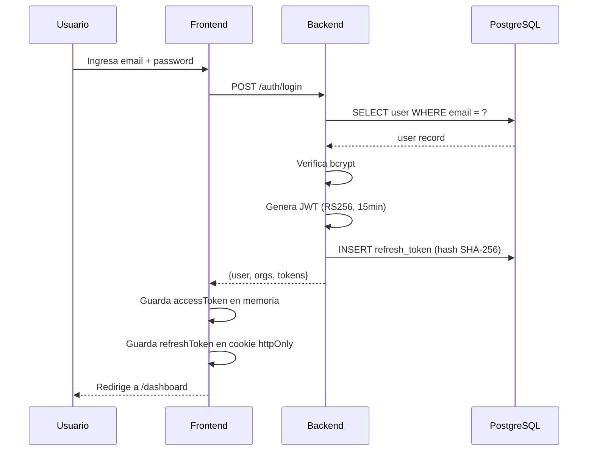
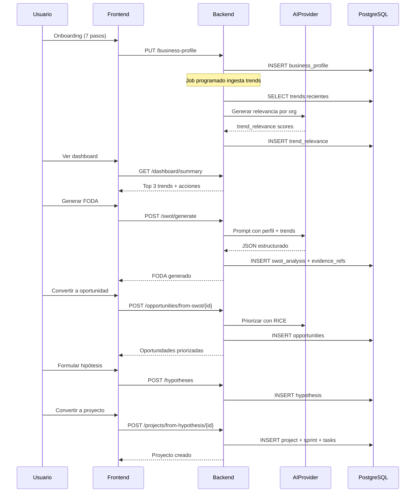
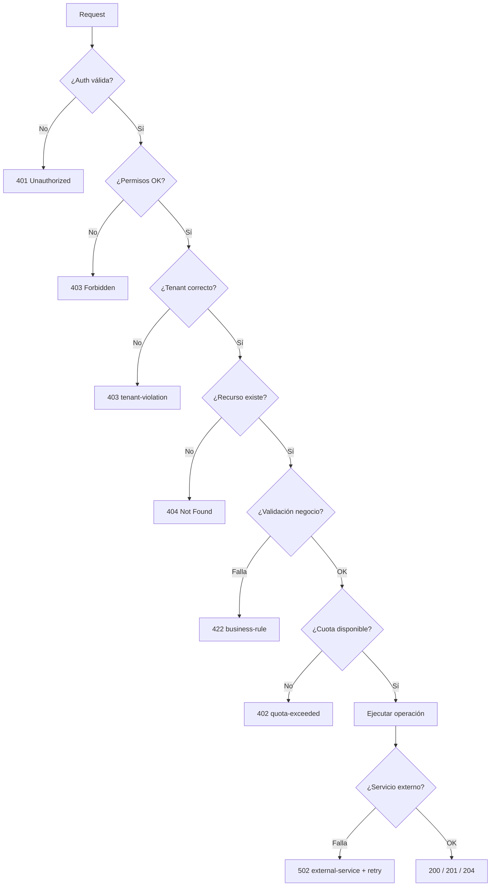

# 04 - Contrato de API (OpenAPI 3.0)

> **Estándar RESTful, Versionado v1, RFC 7807 y Convenciones Multi-Tenant**
>
> v1.0 · Última actualización: 2026-01-XX · Autor: Equipo BOWOL · Estado: Aprobado

---

> **CONTEXTO PARA EL PROGRAMADOR**
>
> Este documento es la **fuente de verdad del contrato HTTP entre frontend y backend**. Cualquier endpoint que exista en el código y no esté aquí es un bug. Cualquier endpoint aquí que no exista en el código es deuda pendiente.
>
> **Reglas duras que NO se negocian:**
> - Toda respuesta exitosa devuelve el recurso o lista directamente (sin wrapper `success/data/message`).
> - Toda respuesta de error sigue RFC 7807 (`ProblemDetail`).
> - El `organization_id` **nunca** se pasa por query param ni body; se extrae del JWT.
> - Los nombres de campos JSON son `camelCase`.
> - Los IDs son UUID v7 en formato string.
> - Los timestamps son ISO 8601 UTC con `Z` al final.
> - Las fechas sin hora son `YYYY-MM-DD`.
> - Los enums son `SCREAMING_SNAKE_CASE` en string.
>
> Referencias cruzadas:
> - Arquitectura backend: `02-ARCHITECTURE.md`
> - Modelo de datos: `03-DATABASE.md`
> - Estrategia de IA: `05-AI-STRATEGY.md`
> - Seguridad y autenticación: `06-SECURITY.md`
> - Glosario: `10-GLOSSARY.md`

---

## 1. Convenciones Globales

### 1.1 Prefijo y versionado

- **Prefijo base:** `/api/v1`
- **Formato:** JSON (`Content-Type: application/json; charset=utf-8`)
- **Encoding:** UTF-8 obligatorio
- **Compresión:** `gzip` y `br` soportados (el cliente envía `Accept-Encoding`)

**Estrategia de versionado:**
- La versión vive en la URL (`/api/v1`, `/api/v2`).
- Cambios breaking → nueva versión. Cambios no-breaking → misma versión.
- Al deprecar una versión, se avisa con headers:
  - `Deprecation: true`
  - `Sunset: Sat, 31 Dec 2026 23:59:59 GMT`
  - `Link: <https://docs.bowol.com/api/v2>; rel="successor-version"`

### 1.2 Autenticación

- **Header:** `Authorization: Bearer <JWT_ACCESS_TOKEN>`
- **Access token TTL:** 15 minutos
- **Refresh token TTL:** 7 días (rotativo, se invalida el anterior al usarlo)
- **Endpoints públicos** (sin auth): `POST /auth/register`, `POST /auth/login`, `POST /auth/refresh`, `GET /health`, `GET /pricing`
- **Endpoints autenticados:** todo lo demás.

Detalle completo en `06-SECURITY.md`.

### 1.3 Multi-tenancy

El `organization_id` se extrae **siempre** del claim del JWT. Nunca se pasa por:
- ❌ Query param (`?organizationId=...`)
- ❌ Body (`{"organizationId": "..."}`)
- ❌ Header custom (`X-Organization-Id`) — salvo excepción justificada en endpoints cross-tenant de plataforma (rol `PLATFORM_ADMIN`).

**Excepción:** usuarios que pertenecen a múltiples organizaciones cambian de tenant mediante `POST /auth/switch-organization`, que devuelve un nuevo par de tokens con el `organization_id` actualizado.

### 1.4 Naming conventions

| Elemento | Convención | Ejemplo |
|---|---|---|
| Rutas | `kebab-case`, plural | `/business-profile`, `/trend-relevances` |
| Campos JSON | `camelCase` | `organizationId`, `createdAt` |
| Enums | `SCREAMING_SNAKE_CASE` | `"IN_PROGRESS"`, `"PENDING_REVIEW"` |
| IDs | UUID v7 como string | `"0191a3f2-..."` |
| Timestamps | ISO 8601 UTC | `"2026-01-15T10:30:00Z"` |
| Fechas | ISO 8601 | `"2026-01-15"` |
| Booleanos | `true` / `false` (nunca 0/1) | `"isActive": true` |

### 1.5 Métodos HTTP

| Método | Uso | Idempotente | Seguro |
|---|---|---|---|
| `GET` | Leer recurso(s) | ✅ | ✅ |
| `POST` | Crear recurso / ejecutar acción no-idempotente | ❌ | ❌ |
| `PUT` | Reemplazar recurso completo | ✅ | ❌ |
| `PATCH` | Modificar parcialmente | ❌ | ❌ |
| `DELETE` | Eliminar recurso | ✅ | ❌ |

### 1.6 Status codes

| Código | Uso |
|---|---|
| `200 OK` | GET, PUT, PATCH exitosos con body |
| `201 Created` | POST que crea recurso (con `Location` header) |
| `202 Accepted` | Operaciones asíncronas (jobs largos) |
| `204 No Content` | DELETE exitoso, sin body |
| `400 Bad Request` | Validación de input falla |
| `401 Unauthorized` | Token ausente, inválido o expirado |
| `403 Forbidden` | Token válido pero sin permisos |
| `404 Not Found` | Recurso no existe o no pertenece al tenant |
| `409 Conflict` | Estado inconsistente (duplicado, versión obsoleta) |
| `402 Payment Required` | Cuota excedida (créditos IA, límite de plan) |
| `422 Unprocessable Entity` | Validación de negocio (ej: fecha fin < inicio) |
| `429 Too Many Requests` | Rate limit excedido |
| `500 Internal Server Error` | Error no controlado |
| `502 Bad Gateway` | Fallo de servicio externo (OpenAI, Stripe) |
| `503 Service Unavailable` | Mantenimiento o sobrecarga |

---

## 2. Estructura de Respuestas

### 2.1 Respuesta exitosa simple

**Sin wrapper.** El recurso o lista se devuelve directamente en el body:

```json
{
  "id": "0191a3f2-1111-7000-8000-000000000001",
  "title": "Automatización de reservas con IA",
  "status": "APPROVED",
  "priorityScore": 42.5,
  "createdAt": "2026-01-15T10:30:00Z"
}
```

**Por qué sin `{success, data, message, timestamp}`:**
- El status HTTP ya comunica éxito o error.
- El wrapper obliga al frontend a hacer `response.data.data` (feo y propenso a errores).
- El `message` genérico es ruido; si se necesita un mensaje, va en un campo del recurso.
- El `timestamp` del servidor no aporta al cliente; si se necesita, va en un header `Date`.

### 2.2 Respuesta de lista paginada

Los metadatos de paginación van en `meta`, el array en `data`:

```json
{
  "data": [
    { "id": "...", "title": "..." },
    { "id": "...", "title": "..." }
  ],
  "meta": {
    "page": 0,
    "size": 20,
    "totalElements": 150,
    "totalPages": 8,
    "hasNext": true,
    "hasPrevious": false
  }
}
```

**Paginación: offset-based (page/size) en MVP, cursor en Fase 2.**

| Aspecto | Offset (MVP) | Cursor (Fase 2) |
|---|---|---|
| Complejidad | Baja | Media |
| Performance en tablas grandes | Degrada con `OFFSET` alto | Constante |
| Saltar a página N | ✅ | ❌ (solo next/prev) |
| Cuándo usar | Hasta ~100k filas | Millones de filas |

Query params estándar:
- `?page=0&size=20&sort=createdAt,desc`
- `size` máximo: `100` (validación en backend).

### 2.3 Respuesta de error (RFC 7807)

```json
{
  "type": "https://api.bowol.com/errors/validation-failed",
  "title": "Validation failed",
  "status": 400,
  "detail": "One or more fields have validation errors",
  "instance": "/api/v1/auth/register",
  "timestamp": "2026-01-15T10:30:00Z",
  "traceId": "abc-123-def-456",
  "errors": [
    { "field": "email", "code": "INVALID_FORMAT", "message": "Must be a valid email address" },
    { "field": "password", "code": "TOO_SHORT", "message": "Must be at least 8 characters" }
  ]
}
```

**Catálogo de `type` (error codes):**

| `type` | HTTP | Cuándo |
|---|---|---|
| `/errors/validation-failed` | 400 | Bean Validation falla |
| `/errors/malformed-request` | 400 | JSON malformado |
| `/errors/unauthorized` | 401 | Sin token o expirado |
| `/errors/invalid-token` | 401 | Token con firma inválida |
| `/errors/forbidden` | 403 | Sin permisos para el recurso |
| `/errors/tenant-violation` | 403 | Intento de acceso cross-tenant |
| `/errors/not-found` | 404 | Recurso no existe en el tenant |
| `/errors/conflict` | 409 | Duplicado o estado inconsistente |
| `/errors/quota-exceeded` | 402 | Créditos IA o límite de plan agotado |
| `/errors/business-rule` | 422 | Regla de negocio violada |
| `/errors/rate-limited` | 429 | Demasiadas peticiones |
| `/errors/external-service` | 502 | Fallo de OpenAI, Stripe, etc. |
| `/errors/internal` | 500 | Error no controlado |

**Regla:** nunca exponer stack traces. El `traceId` enlaza con el log del servidor.

### 2.4 Headers estándar

| Header | Dirección | Propósito |
|---|---|---|
| `Authorization` | Request | Bearer JWT |
| `Idempotency-Key` | Request | UUID para evitar duplicados en POST |
| `X-Trace-Id` | Request/Response | Correlación de logs (opcional en request, siempre en response) |
| `X-RateLimit-Limit` | Response | Cuota total de la ventana |
| `X-RateLimit-Remaining` | Response | Peticiones restantes |
| `X-RateLimit-Reset` | Response | Timestamp UNIX de reset |
| `Location` | Response | URL del recurso creado (en `201`) |
| `Retry-After` | Response | Segundos a esperar (en `429` y `503`) |

### 2.5 Idempotencia

Todos los `POST` que crean recursos aceptan `Idempotency-Key`:

```
POST /api/v1/opportunities
Idempotency-Key: 550e8400-e29b-41d4-a716-446655440000
```

- La clave se guarda 24h con la respuesta asociada.
- Si llega otra request con la misma clave en la ventana, se devuelve la respuesta cacheada con header `Idempotency-Replayed: true`.
- Implementación: tabla `idempotency_keys` (no en el MVP inicial, sí en Fase 12).

### 2.6 Rate limiting

Límites por plan (ventana de 1 minuto):

| Plan | Requests/min | Burst IA/min |
|---|---|---|
| Free | 60 | 2 |
| Pro | 300 | 10 |
| Business | 1000 | 30 |
| Enterprise | Negociado | Negociado |

Al exceder, `429` con `Retry-After`.

---

## 3. Endpoints por Módulo

### 3.1 Health & Metadata (públicos)

| Método | Ruta | Descripción |
|---|---|---|
| `GET` | `/api/v1/health` | Estado del sistema (app + BD + dependencias) |
| `GET` | `/api/v1/version` | Versión de la API y del backend |
| `GET` | `/api/v1/pricing` | Planes disponibles (público para landing) |

**`GET /health` — respuesta `200`:**

```json
{
  "status": "UP",
  "version": "1.0.0",
  "database": "UP",
  "uptime": 86400,
  "timestamp": "2026-01-15T10:30:00Z"
}
```

Si algo falla, devuelve `503` con `status: "DOWN"` y el componente afectado.

### 3.2 Autenticación (`/api/v1/auth`)

| Método | Ruta | Descripción | Auth |
|---|---|---|---|
| `POST` | `/auth/register` | Registrar usuario + crear organización inicial | ❌ |
| `POST` | `/auth/login` | Login con email + password | ❌ |
| `POST` | `/auth/refresh` | Rotar access token con refresh token | ❌ |
| `POST` | `/auth/logout` | Revocar refresh token actual | ✅ |
| `GET` | `/auth/me` | Datos del usuario + organizaciones + permisos | ✅ |
| `POST` | `/auth/switch-organization` | Cambiar tenant activo (devuelve nuevos tokens) | ✅ |
| `POST` | `/auth/forgot-password` | Enviar email de recuperación | ❌ |
| `POST` | `/auth/reset-password` | Resetear password con token | ❌ |
| `PATCH` | `/auth/me/password` | Cambiar password (requiere password actual) | ✅ |

**`POST /auth/register` — request:**

```json
{
  "email": "ana@startup.com",
  "password": "SecurePass123!",
  "name": "Ana García",
  "organizationName": "Startup AI",
  "organizationSlug": "startup-ai"
}
```

**Respuesta `201 Created`:**

```json
{
  "user": {
    "id": "0191a3f2-...",
    "email": "ana@startup.com",
    "name": "Ana García",
    "createdAt": "2026-01-15T10:30:00Z"
  },
  "organization": {
    "id": "0191a3f2-...",
    "name": "Startup AI",
    "slug": "startup-ai",
    "role": "OWNER"
  },
  "tokens": {
    "accessToken": "eyJhbGci...",
    "refreshToken": "eyJhbGci...",
    "expiresIn": 900
  }
}
```

**Errores posibles:**
- `400 validation-failed` — email inválido, password corto
- `409 conflict` — email ya registrado, slug ya tomado

**`POST /auth/login` — request:**

```json
{
  "email": "ana@startup.com",
  "password": "SecurePass123!"
}
```

**Respuesta `200`:**

```json
{
  "user": { "id": "...", "email": "...", "name": "..." },
  "organizations": [
    { "id": "...", "name": "Startup AI", "slug": "startup-ai", "role": "OWNER" }
  ],
  "activeOrganizationId": "0191a3f2-...",
  "tokens": {
    "accessToken": "eyJhbGci...",
    "refreshToken": "eyJhbGci...",
    "expiresIn": 900
  }
}
```

**Errores posibles:**
- `401 unauthorized` — credenciales inválidas (mensaje genérico, no revelar si el email existe)

**`POST /auth/refresh` — request:**

```json
{
  "refreshToken": "eyJhbGci..."
}
```

**Respuesta `200`:** mismos tokens rotados. El refresh anterior queda revocado.

**Errores posibles:**
- `401 invalid-token` — refresh expirado o revocado
- `403 forbidden` — refresh reutilizado (indicador de robo, se revocan todos los tokens del usuario)

**Diagrama de flujo de login:**



### 3.3 Organizaciones y Miembros (`/api/v1/organizations`)

| Método | Ruta | Descripción | Rol mínimo |
|---|---|---|---|
| `GET` | `/organizations` | Listar organizaciones del usuario | Autenticado |
| `GET` | `/organizations/{id}` | Detalle de organización | MEMBER |
| `PATCH` | `/organizations/{id}` | Actualizar datos | ADMIN |
| `DELETE` | `/organizations/{id}` | Soft delete | OWNER |
| `GET` | `/organizations/{id}/members` | Listar miembros | MEMBER |
| `POST` | `/organizations/{id}/members` | Invitar miembro | ADMIN |
| `PATCH` | `/organizations/{id}/members/{userId}` | Cambiar rol | ADMIN |
| `DELETE` | `/organizations/{id}/members/{userId}` | Remover miembro | ADMIN |

**`POST /organizations/{id}/members` — request:**

```json
{
  "email": "carlos@startup.com",
  "role": "MEMBER"
}
```

**Respuesta `201`:** miembro creado con `status: "INVITED"`. Se envía email con link de aceptación.

### 3.4 Perfil de Negocio (`/api/v1/business-profile`)

| Método | Ruta | Descripción |
|---|---|---|
| `GET` | `/business-profile` | Obtener perfil de la organización activa |
| `PUT` | `/business-profile` | Reemplazar perfil completo |
| `PATCH` | `/business-profile` | Actualización parcial |
| `POST` | `/business-profile/onboarding` | Completar onboarding (7 pasos) |

**`PUT /business-profile` — request:**

```json
{
  "industry": "SaaS / Restaurantes",
  "size": "SMALL",
  "market": "Perú",
  "goals": [
    { "text": "Conseguir 50 clientes nuevos", "priority": 1 },
    { "text": "Reducir churn al 3%", "priority": 2 }
  ],
  "problems": ["Poca adquisición de clientes", "Equipo pequeño"],
  "tools": ["Notion", "HubSpot", "Stripe"],
  "competitors": ["Competidor A", "Competidor B"],
  "channels": ["Instagram", "TikTok", "LinkedIn"],
  "digitalMaturity": 45,
  "aiMaturity": 20
}
```

### 3.5 Tendencias (`/api/v1/trends`)

| Método | Ruta | Descripción |
|---|---|---|
| `GET` | `/trends` | Listar tendencias con filtros y paginación |
| `GET` | `/trends?q=...` | Búsqueda full-text (mismo endpoint) |
| `GET` | `/trends/for-me` | Feed personalizado para la organización activa |
| `GET` | `/trends/{id}` | Detalle de tendencia |
| `GET` | `/trends/{id}/relevance` | Score y resumen IA para esta org |
| `POST` | `/trends/{id}/mark-relevant` | Marcar como relevante (pinned) |
| `POST` | `/trends/{id}/dismiss` | Descartar tendencia para esta org |

**Query params de `GET /trends`:**
- `q` — búsqueda full-text
- `source` — filtrar por fuente (`GITHUB`, `YOUTUBE`, etc.)
- `tags` — filtrar por tags (CSV, OR lógico)
- `minScore` — score mínimo
- `from`, `to` — rango de `fetchedAt`
- `page`, `size`, `sort`

**`GET /trends` — respuesta `200`:**

```json
{
  "data": [
    {
      "id": "0191a3f2-...",
      "source": { "code": "GITHUB", "name": "GitHub" },
      "externalId": "openai/openai-agents",
      "title": "OpenAI Agents SDK",
      "description": "Framework for building agentic AI applications",
      "url": "https://github.com/openai/openai-agents",
      "score": 91,
      "tags": ["ai-agents", "llm", "orchestration"],
      "metadata": { "stars": 4200, "forks": 380 },
      "fetchedAt": "2026-01-14T08:00:00Z"
    }
  ],
  "meta": { "page": 0, "size": 20, "totalElements": 342, "totalPages": 18, "hasNext": true }
}
```

### 3.6 AI Research Assistant (`/api/v1/ai/conversations`)

| Método | Ruta | Descripción |
|---|---|---|
| `GET` | `/ai/conversations` | Listar conversaciones del usuario |
| `POST` | `/ai/conversations` | Crear nueva conversación |
| `GET` | `/ai/conversations/{id}` | Obtener conversación con mensajes |
| `POST` | `/ai/conversations/{id}/messages` | Enviar mensaje (respuesta SSE streaming) |
| `DELETE` | `/ai/conversations/{id}` | Eliminar conversación |
| `GET` | `/ai/usage` | Consumo de créditos IA del mes actual |

**`POST /ai/conversations/{id}/messages` — request:**

```json
{
  "content": "¿Los agentes IA aplican a mi negocio de restaurantes?",
  "contextType": "TREND",
  "contextId": "0191a3f2-..."
}
```

**Respuesta:** `200 OK` con `Content-Type: text/event-stream`:

```
event: message_start
data: {"messageId": "0191a3f2-..."}

event: content_delta
data: {"delta": "Sí, "}

event: content_delta
data: {"delta": "existen "}

event: content_delta
data: {"delta": "aplicaciones "}

event: citation
data: {"trendId": "...", "title": "OpenAI Agents SDK", "url": "..."}

event: message_end
data: {"tokensUsed": 342, "cost": 0.0042}

event: done
data: {}
```

**Errores:**
- `402 quota-exceeded` — créditos agotados
- `502 external-service` — OpenAI caído (con fallback automático a Anthropic, si está configurado)

### 3.7 FODA / SWOT (`/api/v1/swot`)

| Método | Ruta | Descripción |
|---|---|---|
| `GET` | `/swot` | Listar FODAs de la organización (histórico) |
| `GET` | `/swot/latest` | Último FODA generado |
| `GET` | `/swot/{id}` | Detalle de un FODA |
| `POST` | `/swot/generate` | Generar nuevo FODA con IA |
| `PATCH` | `/swot/{id}` | Editar items del FODA |
| `POST` | `/swot/{id}/items` | Añadir item |
| `DELETE` | `/swot/{id}/items/{itemId}` | Eliminar item |
| `GET` | `/swot/{id}/evidence` | Evidencias (trends) que respaldan el FODA |
| `DELETE` | `/swot/{id}` | Eliminar FODA |

**`POST /swot/generate` — request:**

```json
{
  "includeTrends": true,
  "maxTrends": 20,
  "aiProvider": "auto"
}
```

**Respuesta `202 Accepted`** (operación asíncrona):

```json
{
  "jobId": "0191a3f2-...",
  "status": "PROCESSING",
  "estimatedSeconds": 25
}
```

El frontend hace polling a `GET /jobs/{jobId}` o escucha por WebSocket/SSE.

**Alternativa MVP:** operación síncrona con timeout de 60s (`200 OK` directo). Se migra a async cuando la generación supere ese tiempo.

**Respuesta `200` (sync):**

```json
{
  "id": "0191a3f2-...",
  "organizationId": "0191a3f2-...",
  "profileSnapshot": { "industry": "SaaS / Restaurantes", "...": "..." },
  "strengths": [
    { "text": "Equipo técnico con experiencia en IA", "evidenceIds": [] }
  ],
  "weaknesses": [
    { "text": "Bajo alcance de marca", "evidenceIds": [] }
  ],
  "opportunities": [
    { "text": "Automatización de reservas con IA", "evidenceIds": ["trend-uuid-1", "trend-uuid-2"] }
  ],
  "threats": [
    { "text": "Competidores con más capital", "evidenceIds": [] }
  ],
  "aiProvider": "openai",
  "aiModelUsed": "gpt-4o",
  "generatedAt": "2026-01-15T10:30:00Z"
}
```

### 3.8 Oportunidades (`/api/v1/opportunities`)

| Método | Ruta | Descripción |
|---|---|---|
| `GET` | `/opportunities` | Listar con filtros y paginación |
| `GET` | `/opportunities/board` | Vista Kanban agrupada por status |
| `GET` | `/opportunities/{id}` | Detalle |
| `POST` | `/opportunities` | Crear manualmente |
| `POST` | `/opportunities/from-swot/{swotId}` | Generar oportunidades desde un FODA |
| `PATCH` | `/opportunities/{id}` | Actualizar parcialmente |
| `PATCH` | `/opportunities/{id}/status` | Cambiar estado |
| `POST` | `/opportunities/{id}/convert-to-project` | Convertir en proyecto |
| `DELETE` | `/opportunities/{id}` | Eliminar |

**`POST /opportunities/from-swot/{swotId}` — respuesta `201`:**

```json
{
  "generated": 5,
  "opportunities": [
    {
      "id": "0191a3f2-...",
      "title": "Asistente IA para reservas",
      "reachScore": 80,
      "impactScore": 90,
      "confidenceScore": 70,
      "effortScore": 50,
      "priorityScore": 100.8,
      "status": "IDENTIFIED"
    }
  ]
}
```

**Fórmula RICE:** `priorityScore = (reach × impact × confidence) / effort`

### 3.9 Hipótesis (`/api/v1/hypotheses`)

| Método | Ruta | Descripción |
|---|---|---|
| `GET` | `/hypotheses` | Listar con filtros |
| `GET` | `/hypotheses/{id}` | Detalle |
| `POST` | `/hypotheses` | Crear hipótesis |
| `PATCH` | `/hypotheses/{id}` | Actualizar |
| `PATCH` | `/hypotheses/{id}/result` | Registrar resultado de validación |
| `DELETE` | `/hypotheses/{id}` | Eliminar |

**`POST /hypotheses` — request:**

```json
{
  "opportunityId": "0191a3f2-...",
  "statement": "Creemos que un asistente IA para reservas reducirá el tiempo de gestión en 40% para restaurantes pequeños. Sabremos que es cierto cuando 5 de 10 restaurantes lo usen a diario durante 2 semanas.",
  "validationMethod": "MVP",
  "successMetric": "Uso diario del asistente",
  "targetValue": "5/10 restaurantes"
}
```

### 3.10 Experimentos (`/api/v1/experiments`)

| Método | Ruta | Descripción |
|---|---|---|
| `GET` | `/experiments` | Listar |
| `GET` | `/experiments/{id}` | Detalle |
| `POST` | `/experiments` | Crear |
| `PATCH` | `/experiments/{id}` | Actualizar |
| `PATCH` | `/experiments/{id}/status` | Cambiar estado |
| `PATCH` | `/experiments/{id}/conclusion` | Registrar conclusión |
| `DELETE` | `/experiments/{id}` | Eliminar |

### 3.11 Proyectos (`/api/v1/projects`)

| Método | Ruta | Descripción |
|---|---|---|
| `GET` | `/projects` | Listar proyectos activos |
| `GET` | `/projects/{id}` | Detalle |
| `POST` | `/projects` | Crear |
| `POST` | `/projects/from-hypothesis/{hypothesisId}` | Crear desde hipótesis validada |
| `PATCH` | `/projects/{id}` | Actualizar |
| `DELETE` | `/projects/{id}` | Soft delete |
| `GET` | `/projects/{id}/members` | Listar miembros |
| `POST` | `/projects/{id}/members` | Añadir miembro |
| `DELETE` | `/projects/{id}/members/{userId}` | Remover miembro |

### 3.12 Sprints (`/api/v1/sprints`)

| Método | Ruta | Descripción |
|---|---|---|
| `GET` | `/projects/{projectId}/sprints` | Listar sprints del proyecto |
| `GET` | `/sprints/{id}` | Detalle |
| `POST` | `/projects/{projectId}/sprints` | Crear sprint |
| `PATCH` | `/sprints/{id}` | Actualizar |
| `PATCH` | `/sprints/{id}/start` | Iniciar sprint |
| `PATCH` | `/sprints/{id}/complete` | Completar sprint |
| `DELETE` | `/sprints/{id}` | Eliminar |

### 3.13 Tareas (`/api/v1/tasks`)

| Método | Ruta | Descripción |
|---|---|---|
| `GET` | `/tasks` | Listar con filtros (proyecto, sprint, status, assignee) |
| `GET` | `/tasks/board` | Vista Kanban por status |
| `GET` | `/tasks/{id}` | Detalle |
| `POST` | `/tasks` | Crear |
| `PATCH` | `/tasks/{id}` | Actualizar |
| `PATCH` | `/tasks/{id}/status` | Cambiar status (drag & drop) |
| `PATCH` | `/tasks/{id}/assign` | Asignar a usuario |
| `POST` | `/tasks/reorder` | Reordenar múltiples tareas (drag & drop masivo) |
| `DELETE` | `/tasks/{id}` | Eliminar |

**`POST /tasks/reorder` — request:**

```json
{
  "moves": [
    { "taskId": "0191a3f2-...", "sprintId": "0191a3f2-...", "status": "IN_PROGRESS", "position": 1500 },
    { "taskId": "0191a3f2-...", "sprintId": "0191a3f2-...", "status": "IN_PROGRESS", "position": 2500 }
  ]
}
```

### 3.14 Dashboard (`/api/v1/dashboard`)

| Método | Ruta | Descripción |
|---|---|---|
| `GET` | `/dashboard/summary` | Resumen ejecutivo ("¿Qué hago hoy?") |

**Respuesta `200`:**

```json
{
  "greeting": "Buenos días, Ana",
  "trendsRelevant": [
    { "id": "...", "title": "OpenAI Agents SDK", "score": 91 }
  ],
  "opportunitiesToReview": 2,
  "activeSprint": {
    "id": "...",
    "name": "Sprint 04",
    "progress": 0.68,
    "daysRemaining": 5
  },
  "myTasksToday": 5,
  "aiCreditsRemaining": 342,
  "activeHypotheses": 3
}
```

### 3.15 Integraciones (`/api/v1/integrations`)

| Método | Ruta | Descripción |
|---|---|---|
| `GET` | `/integrations` | Listar integraciones conectadas |
| `GET` | `/integrations/providers` | Listar proveedores disponibles |
| `POST` | `/integrations/{provider}/connect` | Iniciar OAuth flow |
| `GET` | `/integrations/{provider}/callback` | Callback OAuth (no expuesto al frontend) |
| `DELETE` | `/integrations/{provider}` | Desconectar |
| `POST` | `/integrations/{provider}/sync` | Forzar sincronización manual |

**Proveedores MVP:** `google-calendar`, `github`, `stripe`
**Proveedores Fase 2:** `slack`, `microsoft-calendar`, `notion`, `jira`

### 3.16 Suscripciones (`/api/v1/subscriptions`)

| Método | Ruta | Descripción |
|---|---|---|
| `GET` | `/subscriptions/current` | Suscripción activa de la organización |
| `GET` | `/subscriptions/plans` | Listar planes disponibles |
| `POST` | `/subscriptions/checkout` | Crear sesión de Stripe Checkout |
| `POST` | `/subscriptions/portal` | Crear sesión del Customer Portal de Stripe |
| `POST` | `/subscriptions/cancel` | Cancelar suscripción |
| `POST` | `/webhooks/stripe` | Webhook de Stripe (sin auth JWT, con firma Stripe) |

### 3.17 Audit Logs (`/api/v1/audit-logs`)

| Método | Ruta | Descripción | Rol |
|---|---|---|---|
| `GET` | `/audit-logs` | Listar eventos auditables | ADMIN |
| `GET` | `/audit-logs/{id}` | Detalle de un evento | ADMIN |

**Query params:** `action`, `entityType`, `userId`, `from`, `to`, `page`, `size`

### 3.18 Notificaciones (`/api/v1/notifications`)

| Método | Ruta | Descripción |
|---|---|---|
| `GET` | `/notifications` | Listar no leídas |
| `PATCH` | `/notifications/{id}/read` | Marcar como leída |
| `PATCH` | `/notifications/read-all` | Marcar todas como leídas |
| `DELETE` | `/notifications/{id}` | Eliminar |

---

## 4. Diagramas de Flujos Críticos

### 4.1 Ciclo completo Intelligence → Execution



### 4.2 Manejo de errores con retry



---

## 5. Checklist de Validación

Antes de aprobar este documento, verificar:

- [ ] Todas las rutas usan `/api/v1` como prefijo.
- [ ] Todos los campos JSON están en `camelCase`.
- [ ] Todos los enums están en `SCREAMING_SNAKE_CASE`.
- [ ] Todos los timestamps están en ISO 8601 UTC con `Z`.
- [ ] Ningún endpoint acepta `organizationId` por query/body/header.
- [ ] Todos los errores siguen RFC 7807 con `type`, `title`, `status`, `detail`, `instance`, `timestamp`, `traceId`.
- [ ] El catálogo de error codes está completo y documentado.
- [ ] Los endpoints de creación soportan `Idempotency-Key`.
- [ ] Los endpoints de lista tienen paginación, filtros y sort documentados.
- [ ] Los endpoints SSE (`/ai/conversations/{id}/messages`) están documentados con formato de eventos.
- [ ] Los diagramas Mermaid renderizan correctamente.
- [ ] Cada endpoint tiene al menos un ejemplo de request y uno de response.
- [ ] Los códigos HTTP están correctos (201 para creación, 204 para delete, etc.).
- [ ] El documento referencia `06-SECURITY.md` para detalles de auth.
- [ ] Sin emojis en ninguna sección.

---

**FIN DEL DOCUMENTO `04-API-CONTRACT.md`**