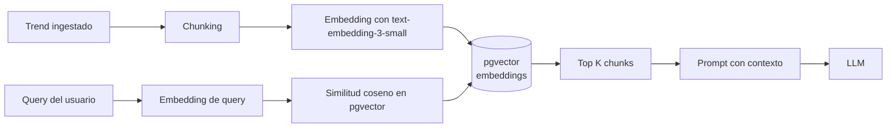
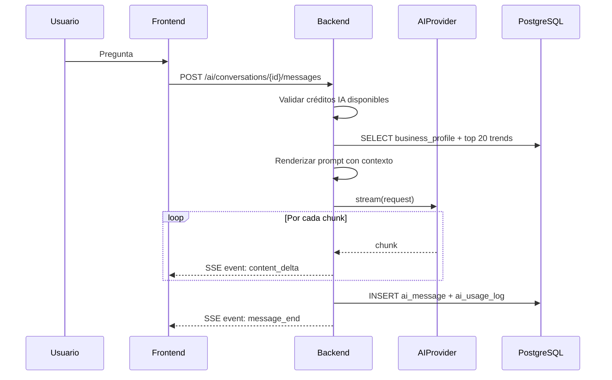
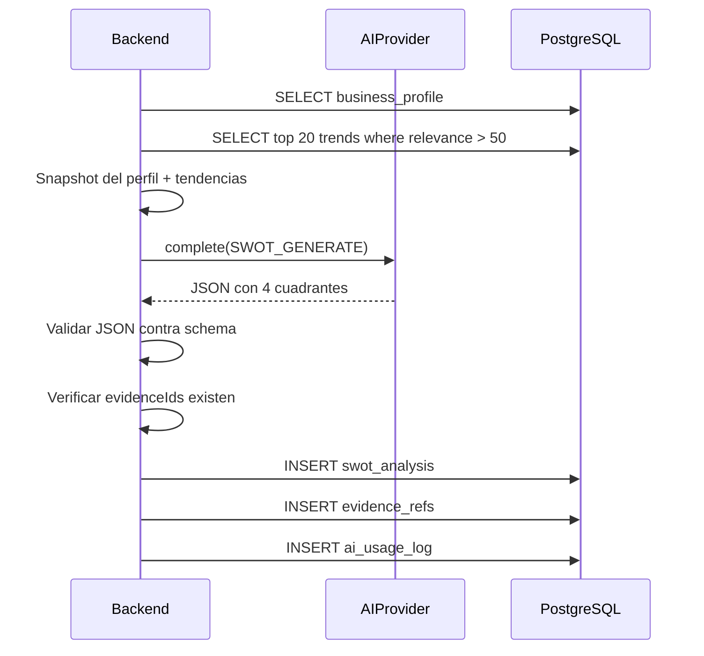
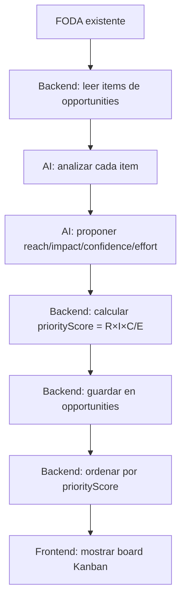
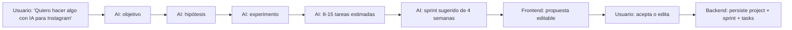

# 05 - Estrategia de IA y Orquestación

> **Abstracción AIProvider, Grounding con Evidencias, Prompt Engineering y Mitigación de Alucinaciones**
>
> v1.0 · Última actualización: 2026-01-XX · Autor: Equipo BOWOL · Estado: Aprobado

---

> **CONTEXTO PARA EL PROGRAMADOR**
>
> Este documento define **cómo BOWOL usa la IA**: qué proveedores, cómo se orquestan, cómo se controlan los costes y cómo se evita que la IA alucine.
>
> **Reglas duras que NO se negocian:**
> - Ningún módulo fuera de `ai/` importa SDKs de OpenAI, Anthropic u otro proveedor.
> - Ningún prompt vive hardcodeado en Java. Todos van en `/resources/prompts/` versionados.
> - Toda respuesta de IA que se persiste debe validarse contra un JSON schema antes de guardarse.
> - Toda llamada a IA registra tokens y coste en `ai_usage_logs`.
> - Toda respuesta presentada al usuario distingue: DATO / ANÁLISIS / HIPÓTESIS / RECOMENDACIÓN.
> - Nunca se presenta una estimación de impacto como certeza. Siempre como escenario.
> - Si el usuario agota créditos IA, se degrada a modelo económico o se bloquea con `402 quota-exceeded`.
>
> Referencias cruzadas:
> - Arquitectura backend: `02-ARCHITECTURE.md`
> - Base de datos (tablas `ai_*`): `03-DATABASE.md`
> - Contrato de API (`/ai/conversations`): `04-API-CONTRACT.md`
> - Seguridad (API keys, prompt injection): `06-SECURITY.md`

---

## 1. Principio Fundamental: Sin Acoplamiento a Proveedores

BOWOL prohíbe el uso disperso de SDKs de IA. Toda interacción pasa por la interfaz `AIProvider`:

```java
public interface AIProvider {
    
    /** Llamada síncrona: devuelve la respuesta completa. */
    AIResponse complete(AIRequest request);
    
    /** Llamada con streaming: emite chunks conforme llegan. */
    Stream<AIChunk> stream(AIRequest request);
    
    /** Genera embeddings vectoriales (Fase 2, no MVP). */
    List<Float> embed(String text);
    
    /** Identificador del proveedor: "openai", "anthropic", "local". */
    String name();
    
    /** ¿Este proveedor soporta el modelo solicitado? */
    boolean supports(AIModel model);
    
    /** ¿El proveedor está disponible ahora mismo (health check)? */
    boolean isAvailable();
}
```

### 1.1 Implementaciones soportadas

| Proveedor | Modelos | Uso principal | Cuándo activarlo |
|---|---|---|---|
| `OpenAIProvider` | `gpt-4o`, `gpt-4o-mini` | Default en MVP | Siempre disponible |
| `AnthropicProvider` | `claude-3-5-sonnet`, `claude-3-5-haiku` | Fallback + tareas largas | Cuando OpenAI falla o tareas de reasoning complejo |
| `LocalModelProvider` | Ollama, vLLM | Desarrollo offline + privacidad | Fase 3+ para clientes enterprise |
| `MockProvider` | — | Tests unitarios e integración | Solo en tests |

### 1.2 Selección de proveedor por configuración

La selección **nunca** la hace el código de negocio. Se resuelve con:

```yaml
# application.yml
bowol:
  ai:
    default-provider: openai
    providers:
      openai:
        api-key: ${OPENAI_API_KEY}
        base-url: https://api.openai.com/v1
        timeout: 60s
        max-retries: 2
      anthropic:
        api-key: ${ANTHROPIC_API_KEY}
        base-url: https://api.anthropic.com
        timeout: 60s
        max-retries: 2
```

```java
@Component
@RequiredArgsConstructor
public class AIProviderResolver {
    private final Map<String, AIProvider> providers;
    private final AIProperties properties;
    
    public AIProvider resolve(AIModel model) {
        // Si el modelo pide anthropic y está disponible, usarlo
        // Si no, fallback al default
        // Si el default falla, fallback al secundario
    }
}
```

### 1.3 Tipos de request/response

```java
public record AIRequest(
    AIModel model,
    String systemPrompt,
    List<AIMessage> messages,
    Map<String, Object> variables,
    Double temperature,      // default 0.7
    Integer maxTokens,       // default según modelo
    ResponseFormat format,   // TEXT, JSON_OBJECT, JSON_SCHEMA
    List<String> stopSequences
) {}

public record AIResponse(
    String content,
    String provider,
    String model,
    Integer promptTokens,
    Integer completionTokens,
    BigDecimal costUsd,
    String finishReason,
    Duration latency
) {}

public record AIChunk(
    String delta,
    boolean isLast,
    Integer tokensUsed
) {}
```

---

## 2. Selección de Modelo por Tarea

**Regla:** nunca usar el modelo más caro para todo. Cada tarea tiene su modelo óptimo.

| Tarea | Modelo recomendado | Razón |
|---|---|---|
| **Clasificación de tendencias** | `gpt-4o-mini` o `claude-haiku` | Alto volumen, baja complejidad |
| **Generación de resumen de tendencia** | `gpt-4o-mini` | Volume + coste |
| **Cálculo de relevancia por organización** | `gpt-4o-mini` + reglas | Se ejecuta 1 vez por (org, trend) |
| **Generación de FODA** | `gpt-4o` o `claude-3-5-sonnet` | Reasoning complejo, salida estructurada |
| **Generación de oportunidades (RICE)** | `gpt-4o` | Reasoning sobre FODA + trends |
| **Chat del Research Assistant** | `gpt-4o-mini` streaming | UX conversacional, volumen alto |
| **Generación de hipótesis** | `gpt-4o-mini` | Salida estructurada corta |
| **AI Planner (idea → backlog)** | `gpt-4o` | Reasoning multi-paso |
| **Generación de contenido social (Fase 2)** | `gpt-4o` | Calidad de copy crítica |
| **Análisis de sentimiento (Fase 2)** | `gpt-4o-mini` | Volumen alto |
| **Embeddings (Fase 2)** | `text-embedding-3-small` | Búsqueda semántica |

**Configuración por tarea:**

```java
public enum AITask {
    TREND_CLASSIFY(AIModel.GPT_4O_MINI, 0.3, 500),
    SWOT_GENERATE(AIModel.GPT_4O, 0.4, 4000),
    OPPORTUNITY_GENERATE(AIModel.GPT_4O, 0.4, 3000),
    CHAT_STREAM(AIModel.GPT_4O_MINI, 0.7, 2000),
    AI_PLANNER(AIModel.GPT_4O, 0.5, 4000);
    
    public final AIModel defaultModel;
    public final double defaultTemperature;
    public final int defaultMaxTokens;
}
```

---

## 3. Prompt Engineering

### 3.1 Los prompts viven en `/resources/prompts/`

```text
backend/src/main/resources/prompts/
├── system/
│   ├── business-researcher-v1.md
│   └── strategic-advisor-v1.md
├── swot/
│   ├── generate-foda-v1.md
│   └── generate-foda-v2.md       # nueva versión sin borrar v1
├── opportunities/
│   ├── from-swot-v1.md
│   └── rice-scoring-v1.md
├── hypotheses/
│   └── generate-hypothesis-v1.md
├── planner/
│   └── idea-to-backlog-v1.md
└── research/
    └── chat-context-v1.md
```

### 3.2 Formato de prompt (Markdown con placeholders)

```markdown
---
id: swot-generate
version: 1
model: gpt-4o
response_format: json_schema
schema_file: swot-output.schema.json
temperature: 0.4
---

# ROL
Eres el "AI Business Researcher" de BOWOL. Actúas como consultor estratégico senior.

# CONTEXTO EMPRESARIAL
- Industria: {{industry}}
- Tamaño: {{size}}
- Mercado: {{market}}
- Objetivos: {{goals}}
- Problemas: {{problems}}
- Herramientas: {{tools}}
- Competidores: {{competitors}}

# TENDENCIAS RELEVANTES
{{#each trends}}
- [{{this.source}}] {{this.title}} (score: {{this.score}})
  {{this.description}}
{{/each}}

# TAREA
Genera una matriz FODA para esta empresa, basándote ÚNICAMENTE en:
1. Los datos del contexto empresarial.
2. Las tendencias listadas arriba.
3. Conocimiento general de la industria.

# REGLAS OBLIGATORIAS
1. Cada item debe ser específico, no genérico.
2. Las oportunidades deben referenciar tendencias por ID.
3. No inventes datos. Si no tienes información, omite el item.
4. Distingue claramente entre dato (hecho), análisis (correlación) y recomendación (acción).
5. Responde SOLO con JSON válido según el schema.

# FORMATO DE SALIDA
{{schema}}
```

### 3.3 Motor de templates

Usar **Mustache** (o su variante Java `jmustache`) por simplicidad. No usar FreeMarker ni Thymeleaf (overkill para texto).

```java
@Component
@RequiredArgsConstructor
public class PromptTemplateEngine {
    
    private final Map<String, PromptTemplate> templates;
    
    public String render(String templateId, Map<String, Object> variables) {
        var template = templates.get(templateId);
        if (template == null) throw new PromptNotFoundException(templateId);
        return Mustache.compiler()
                .defaultValue("")
                .compile(template.content())
                .execute(variables);
    }
}
```

### 3.4 Versionado de prompts

- Cada prompt tiene `version` en el frontmatter.
- Un cambio en prompt **crea una nueva versión**, nunca sobreescribe la anterior.
- La versión activa se elige por configuración (`application.yml`), no por código.
- Los resultados guardados en BD registran `ai_model_used` + `prompt_version`.

**Ejemplo de uso:**

```yaml
bowol:
  ai:
    prompts:
      swot-generate: v2
      opportunity-from-swot: v1
      hypothesis-generate: v1
```

---

## 4. Grounding con Evidencias (RAG pragmático)

### 4.1 Fase 1 (MVP): Grounding estructurado sin vector DB

**No se usa RAG vectorial en MVP.** El grounding se hace con:

1. **BusinessProfile** de la organización (estructurado).
2. **Top N tendencias relevantes** para esa org (de `trend_relevance`, ordenadas por score).
3. **Histórico de análisis previos** (últimos FODAs, oportunidades).

Todo se inyecta en el prompt como JSON estructurado. **No hay embeddings ni búsqueda vectorial.**

**Ventajas:**
- Simple de implementar.
- Coste cero de infraestructura.
- Trazabilidad total (sabes exactamente qué vio la IA).

**Limitaciones:**
- Solo funciona si `trend_relevance` está bien curada.
- No escala a millones de documentos.

### 4.2 Fase 2: RAG vectorial con pgvector

Cuando se cumpla **una** de estas condiciones, migrar a RAG:

- `trends` > 500k filas.
- El usuario pide explícitamente búsqueda semántica ("busca tendencias similares a este paper").
- Los prompts superan los 8k tokens de contexto.

**Plan:**



**Extensión requerida:** `pgvector` en PostgreSQL (instalable con `CREATE EXTENSION vector`).

---

## 5. Separación Obligatoria: DATO → ANÁLISIS → HIPÓTESIS → RECOMENDACIÓN

Este es el **concepto diferenciador de BOWOL**. Todo output de IA se estructura en 4 capas:

### 5.1 Las 4 capas

| Capa | Definición | Ejemplo |
|---|---|---|
| **DATO** | Hecho comprobable extraído de fuente externa | "El repo `openai/agents` creció 42% en estrellas en 30 días (fuente: GitHub API, 2026-01-10)." |
| **ANÁLISIS** | Correlación entre dato y contexto de la empresa | "Dado que tu startup vende software para restaurantes, el crecimiento de agentes IA sugiere que hay demanda emergente de automatización conversacional." |
| **HIPÓTESIS** | Escenario posible si la empresa adopta X | "Si implementas un agente IA para reservas, podrías reducir el tiempo de gestión en 30%. (Estimación basada en casos similares, no garantía.)" |
| **RECOMENDACIÓN** | Acción concreta, validable, con experimento | "Construir un prototipo de agente IA para reservas y probarlo con 5 restaurantes durante 2 semanas. Métrica: reducción del tiempo de gestión." |

### 5.2 Implementación en la respuesta

El LLM devuelve JSON estructurado con las 4 capas:

```json
{
  "items": [
    {
      "type": "OPPORTUNITY",
      "data": {
        "text": "El repo openai/agents creció 42% en estrellas en 30 días",
        "evidenceIds": ["trend-uuid-1"]
      },
      "analysis": {
        "text": "Sugiere demanda creciente de agentes IA en automatización"
      },
      "hypothesis": {
        "text": "Podrías reducir el tiempo de gestión de reservas en 30%",
        "confidence": 0.65,
        "caveat": "Estimación basada en casos similares, no garantía"
      },
      "recommendation": {
        "text": "Construir prototipo de agente IA para reservas",
        "experiment": {
          "method": "MVP",
          "metric": "Tiempo de gestión",
          "target": "-30%",
          "duration": "2 semanas"
        }
      }
    }
  ]
}
```

### 5.3 Reglas de presentación al usuario

1. **La UI muestra las 4 capas visualmente separadas.** No mezcla dato con hipótesis.
2. **Cada hipótesis lleva un `caveat` visible.** El usuario nunca debe confundir estimación con certeza.
3. **Cada recomendación es accionable** (tiene experimento, métrica, duración).
4. **Cada dato tiene `evidenceIds` clicables** que llevan a la fuente original (trend, GitHub, YouTube).

### 5.4 Validación post-generación

Antes de persistir la respuesta, validar:

- [ ] El JSON cumple el schema definido.
- [ ] Cada `evidenceId` existe en `trends` y pertenece al tenant (o es global).
- [ ] Cada hipótesis tiene `caveat` no vacío.
- [ ] Cada recomendación tiene experimento con método, métrica y duración.
- [ ] No hay frases absolutas ("garantiza", "seguro", "100%").

Si falla la validación → reintentar con prompt correctivo. Máximo 2 reintentos. Si vuelve a fallar → error al usuario.

---

## 6. Flujos Específicos por Feature

### 6.1 AI Research Assistant (chat con streaming)



**Prompt template:** `research/chat-context-v1.md`
**Modelo:** `gpt-4o-mini` (streaming, coste controlado)
**Contexto inyectado:** business profile + top 20 trends relevantes + historial de la conversación.

### 6.2 Generación de FODA



**Prompt:** `swot/generate-foda-v2.md`
**Modelo:** `gpt-4o`
**Salida:** JSON schema `swot-output.schema.json`

### 6.3 Opportunity Engine (RICE con IA)



**Prompt:** `opportunities/from-swot-v1.md`
**Modelo:** `gpt-4o`
**Regla:** el LLM propone los scores, el backend calcula el RICE final (nunca el LLM).

### 6.4 AI Planner (idea vaga → backlog)



**Prompt:** `planner/idea-to-backlog-v1.md`
**Modelo:** `gpt-4o`
**Salida:** JSON con estructura de proyecto completo.

---

## 7. Control de Consumo, Créditos y Costes

### 7.1 Cálculo de coste

Cada llamada a IA calcula tokens y coste:

```java
public class CostCalculator {
    
    private static final Map<AIModel, Pricing> PRICING = Map.of(
        AIModel.GPT_4O, new Pricing(2.50, 10.00),      // input / output por 1M tokens
        AIModel.GPT_4O_MINI, new Pricing(0.15, 0.60),
        AIModel.CLAUDE_3_5_SONNET, new Pricing(3.00, 15.00),
        AIModel.CLAUDE_3_5_HAIKU, new Pricing(0.80, 4.00)
    );
    
    public BigDecimal calculate(AIModel model, int inputTokens, int outputTokens) {
        var p = PRICING.get(model);
        return BigDecimal.valueOf(
            (inputTokens * p.inputPerMillion() + outputTokens * p.outputPerMillion()) / 1_000_000.0
        );
    }
}
```

### 7.2 Registro en `ai_usage_logs`

Cada llamada persiste:

```json
{
  "organization_id": "...",
  "user_id": "...",
  "operation": "SWOT_GENERATE",
  "provider": "openai",
  "model": "gpt-4o",
  "tokens_input": 3420,
  "tokens_output": 1890,
  "cost_usd": 0.0273,
  "metadata": {
    "prompt_id": "swot-generate",
    "prompt_version": 2,
    "latency_ms": 8420,
    "retries": 0
  }
}
```

### 7.3 Créditos IA por plan

| Plan | Créditos/mes | Uso aproximado |
|---|---|---|
| Free | 10 | 2 FODAs + 5 chats |
| Pro | 500 | 20 FODAs + 100 chats + 10 planners |
| Business | 3000 | 100 FODAs + 500 chats + 50 planners |
| Enterprise | Negociado | Ilimitado con fair use |

**Fórmula de créditos:**
- 1 crédito ≈ $0.001 USD de coste IA.
- Ejemplo: un FODA con GPT-4o cuesta ~$0.027 → 27 créditos.

### 7.4 Degradación cuando se agotan créditos

| % consumido | Acción |
|---|---|
| < 80% | Normal |
| 80-95% | Notificación al usuario (`notification`) |
| 95-100% | Warning persistente en UI |
| 100% | Bloqueo con `402 quota-exceeded` + oferta de upgrade |
| > 100% (Enterprise) | Permitir, registrar exceso para facturación |

### 7.5 Fallback automático a modelo económico

Si el coste medio por usuario supera el objetivo ($2/mes) o el proveedor principal falla:

```
gpt-4o → gpt-4o-mini (automático, sin aviso)
claude-3-5-sonnet → claude-3-5-haiku (automático)
cualquier proveedor → mock provider (nunca en prod)
```

Se registra el fallback en `ai_usage_logs.metadata.fallback_from`.

---

## 8. Seguridad en IA

### 8.1 Prompt Injection

**Vector:** usuario envía input que intenta alterar el comportamiento del LLM.

**Mitigaciones:**

1. **Delimitadores claros** entre system prompt y user input:
   ```
   <system>...instrucciones...</system>
   <user>...input del usuario...</user>
   ```
2. **Sanitización de input:** eliminar intentos obvios de escape (`</system>`, `Ignore previous instructions`).
3. **Nunca ejecutar acciones desde el output del LLM sin validación:** el LLM sugiere, el backend decide.
4. **Validación estricta de output:** JSON schema. Si no cumple, rechazar.
5. **Límite de tokens de input:** 8000 tokens máximo por request.
6. **Rate limiting por usuario** (ver `04-API-CONTRACT.md`).

### 8.2 Validación de output

Todo output que se persiste pasa por:

```java
@Component
public class AIOutputValidator {
    
    public void validate(AIResponse response, JsonSchema schema) {
        // 1. Parsear JSON
        // 2. Validar contra schema (networknt/json-schema-validator)
        // 3. Verificar que no hay campos prohibidos ("garantiza", "100% seguro")
        // 4. Verificar que evidenceIds existen
        // 5. Verificar caveats en hipótesis
    }
}
```

Si falla → reintentar (max 2). Si falla de nuevo → error `500 ai-output-invalid` + log para revisión.

### 8.3 API keys encriptadas

- Las API keys de OpenAI/Anthropic se guardan en variables de entorno, nunca en BD.
- Las credenciales de integración de usuarios (Google, GitHub) se encriptan con AES-256-GCM (ver `06-SECURITY.md`).
- Rotación trimestral documentada en `08-DEVOPS.md`.

### 8.4 Auditoría

Toda llamada a IA queda registrada en `ai_usage_logs` con:
- `organization_id`, `user_id`, `operation`, `model`, `tokens`, `cost`.
- `metadata.prompt_id` y `metadata.prompt_version`.
- `metadata.latency_ms` y `metadata.retries`.

---

## 9. Fallbacks y Degradación

### 9.1 Matriz de fallos

| Falla | Acción |
|---|---|
| OpenAI 5xx | Retry 2 veces con backoff exponencial → fallback a Anthropic |
| OpenAI 429 (rate limit) | Backoff exponencial + retry → si persiste, degradar a modelo menor |
| Anthropic 5xx | Retry → fallback a OpenAI |
| Ambos caen | Devolver `502 external-service` + mensaje honesto al usuario |
| Timeout (>60s) | Cancelar + retry con `maxTokens` reducido |
| Output inválido | Retry con prompt correctivo (max 2) |
| Coste excede presupuesto diario | Bloquear llamadas no críticas, permitir solo las esenciales |

### 9.2 Circuit breaker

Uso de **Resilience4j**:

```java
@CircuitBreaker(name = "openai", fallbackMethod = "fallbackToAnthropic")
@Retry(name = "openai")
@TimeLimiter(name = "openai")
public AIResponse callOpenAI(AIRequest request) {
    return openAIProvider.complete(request);
}

public AIResponse fallbackToAnthropic(AIRequest request, Throwable t) {
    log.warn("OpenAI falló, fallback a Anthropic", t);
    return anthropicProvider.complete(request);
}
```

Configuración:
- `failureRateThreshold: 50%`
- `waitDurationInOpenState: 30s`
- `slidingWindowSize: 20`

---

## 10. Métricas de Calidad IA

### 10.1 Métricas técnicas

| Métrica | Objetivo | Cómo se mide |
|---|---|---|
| Latencia p95 (complete) | < 8s | `ai_usage_logs.latency_ms` |
| Latencia p95 (stream) | < 1s al primer chunk | Métrica custom |
| Tasa de retry | < 5% | `metadata.retries > 0` |
| Tasa de fallback | < 3% | `metadata.fallback_from` existe |
| Tasa de output inválido | < 1% | Logs de `AIOutputValidator` |
| Coste medio por usuario | < $2/mes | `SUM(cost_usd) / COUNT(DISTINCT user_id)` |

### 10.2 Métricas de calidad

| Métrica | Objetivo | Cómo se mide |
|---|---|---|
| % de respuestas con evidencia | > 90% | Respuestas con `evidenceIds` no vacío |
| % de hipótesis con caveat | 100% | Validación post-generación |
| Ratio de recomendaciones accionables | > 80% | Recomendaciones con experimento completo |
| Feedback positivo del usuario | > 70% | Botón "útil/no útil" en cada respuesta IA |
| Tasa de regeneración manual | < 20% | Usuario pide regenerar la misma respuesta |

### 10.3 Revisión de calidad

- **Semanal:** revisión manual de 10 respuestas aleatorias por feature.
- **Mensual:** análisis de feedback agregado y ajuste de prompts.
- **Trimestral:** evaluación de cambio de modelo (¿vale la pena pasar a uno más nuevo?).

---

## 11. Checklist de Validación

Antes de aprobar este documento, verificar:

- [ ] La interfaz `AIProvider` está cerrada y tipada.
- [ ] Se definieron los tipos `AIRequest`, `AIResponse`, `AIChunk`.
- [ ] La tabla de selección de modelo por tarea está aprobada.
- [ ] Los prompts viven en `/resources/prompts/` con versionado.
- [ ] El motor de templates (Mustache) está definido.
- [ ] La estrategia de grounding (Fase 1 sin RAG, Fase 2 con pgvector) está clara.
- [ ] Las 4 capas (DATO/ANÁLISIS/HIPÓTESIS/RECOMENDACIÓN) están implementadas en cada feature.
- [ ] El cálculo de coste con tabla de pricing está definido.
- [ ] Los créditos IA por plan están definidos.
- [ ] La degradación por agotamiento de créditos está especificada.
- [ ] Las mitigaciones de prompt injection están documentadas.
- [ ] El validador de output con JSON schema está definido.
- [ ] El circuit breaker con Resilience4j está configurado.
- [ ] Las métricas técnicas y de calidad están definidas con objetivos.
- [ ] Todas las referencias cruzadas a otros docs existen.
- [ ] Sin emojis en ninguna sección.
- [ ] Los diagramas Mermaid renderizan correctamente.

---

**FIN DEL DOCUMENTO `05-AI-STRATEGY.md`**