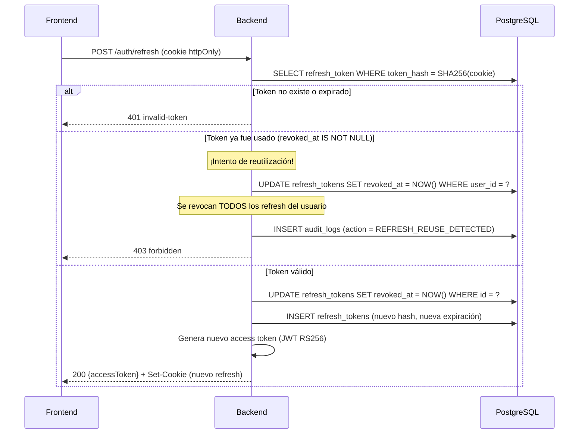
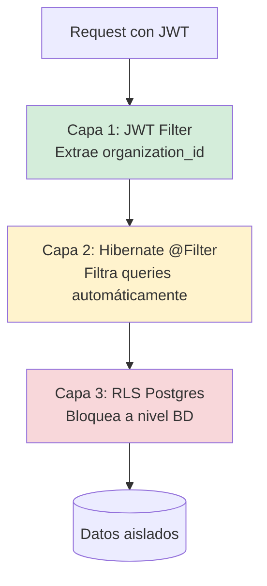

# 06 - Seguridad y Control de Acceso

> **JWT Asimétrico (RS256), RBAC Granular, Multi-Tenancy en 3 Capas y Cumplimiento GDPR**
>
> v1.0 · Última actualización: 2026-01-XX · Autor: Equipo BOWOL · Estado: Aprobado

---

> **CONTEXTO PARA EL PROGRAMADOR**
>
> Este documento define **cómo se protege BOWOL**. Toda decisión de seguridad es vinculante: no se negocia por velocidad ni por conveniencia.
>
> **Reglas duras que NO se negocian:**
> - Toda petición autenticada viaja con `organization_id` en el JWT. Nunca por query, body o header custom.
> - Ninguna query toca la BD sin pasar por el filtro multi-tenant (Hibernate `@Filter` + RLS).
> - Ningún password se guarda en texto plano. Siempre bcrypt con coste 12.
> - Ningún refresh token se guarda en texto plano. Siempre hash SHA-256.
> - Ningún secreto (API keys, tokens OAuth) se guarda sin cifrar. Siempre AES-256-GCM.
> - Toda respuesta de error es RFC 7807 con `traceId`, sin stack traces.
> - Toda acción crítica se registra en `audit_logs` (login fallido, cambio de rol, eliminación, cambio de plan).
> - Los logs nunca contienen passwords, tokens, PII completa ni datos de tarjeta.
>
> Referencias cruzadas:
> - Arquitectura backend: `02-ARCHITECTURE.md`
> - Base de datos (RLS, tablas `*_tokens`, `audit_logs`): `03-DATABASE.md`
> - Contrato de API (`auth`, errores): `04-API-CONTRACT.md`
> - Estrategia de IA (prompt injection): `05-AI-STRATEGY.md`
> - DevOps (rotación de secretos, backups): `08-DEVOPS.md`

---

## 1. Modelo de Amenazas (STRIDE)

Antes de diseñar defensas, identificamos qué nos amenaza.

| Amenaza | Ejemplo en BOWOL | Mitigación principal |
|---|---|---|
| **S**poofing | Robo de JWT para suplantar a otro usuario | RS256, TTL corto (15 min), rotación de refresh, fingerprint de dispositivo |
| **T**ampering | Modificar un payload de petición para cambiar `organization_id` | `organization_id` **siempre** del JWT firmado, nunca del body |
| **R**epudiation | Usuario niega haber borrado un proyecto | `audit_logs` inmutable con IP y user agent |
| **I**nformation Disclosure | Usuario A ve datos de organización B | Hibernate `@Filter` + RLS en Postgres + tests de aislamiento |
| **D**enial of Service | Atacante satura la API de IA con requests | Rate limiting por plan + circuit breaker + coste máximo diario |
| **E**levation of Privilege | MEMBER intenta cambiar el plan de suscripción | RBAC + verificación server-side de permisos, nunca confiar en el frontend |

**Regla:** cualquier feature nuevo se revisa contra esta tabla antes de aprobarse.

---

## 2. Autenticación: JWT Asimétrico RS256

### 2.1 Por qué RS256 y no HS256

| Aspecto | HS256 (simétrico) | RS256 (asimétrico) |
|---|---|---|
| Firma | 1 clave compartida | Clave privada firma, pública verifica |
| Escalado | Cada servicio necesita la clave → riesgo de filtración | Solo el emisor tiene la privada |
| Rotación de claves | Todas las partes deben actualizar a la vez | Verificador solo necesita el JWKS endpoint |
| Microservicios futuros | Problemático | Trivial |

**Decisión:** RS256 con claves de 2048 bits, rotación cada 6 meses.

### 2.2 Par de claves

- **Privada:** almacenada como secreto (variable de entorno o secrets manager), nunca en repo.
- **Pública:** expuesta en `GET /api/v1/.well-known/jwks.json` (formato JWKS estándar).
- **Rotación:** cada 6 meses. La clave vieja sigue publicada 30 días después de rotar (para validar tokens en vuelo).

### 2.3 Access Token

**Especificación:**

| Propiedad | Valor |
|---|---|
| Formato | JWT (JWS, compact serialization) |
| Algoritmo | RS256 |
| TTL | 15 minutos |
| Almacenamiento cliente | Memoria (no localStorage, no sessionStorage) |
| Renovación | Silenciosa al expirar, vía refresh token |

**Claims:**

| Claim | Tipo | Descripción | Ejemplo |
|---|---|---|---|
| `iss` | string | Emisor | `https://api.bowol.com` |
| `sub` | string (UUID) | ID del usuario | `0191a3f2-...` |
| `aud` | string | Audiencia | `bowol-api` |
| `exp` | number | Expiración (UNIX) | `1737021000` |
| `iat` | number | Emitido en | `1737020100` |
| `jti` | string (UUID) | ID único del token | `0191a3f2-...` |
| `organization_id` | string (UUID) | Tenant activo | `0191a3f2-...` |
| `role` | string | Rol del usuario en el tenant | `ADMIN` |
| `email` | string | Email del usuario (para UX) | `ana@startup.com` |
| `name` | string | Nombre (para UX) | `Ana García` |

**Regla:** el JWT **no lleva permisos**. Los permisos se resuelven en cada request contra la caché en memoria (ver sección 3). El rol sí va porque es estable durante la sesión.

### 2.4 Refresh Token

**Especificación:**

| Propiedad | Valor |
|---|---|
| Formato | String aleatorio 256 bits (base64url) — **no es JWT** |
| TTL | 7 días |
| Almacenamiento cliente | Cookie `httpOnly`, `Secure`, `SameSite=Strict`, `Path=/api/v1/auth` |
| Almacenamiento servidor | Hash SHA-256 en tabla `refresh_tokens` |
| Rotación | Obligatoria. Cada refresh genera uno nuevo y revoca el anterior |

**Por qué string opaco y no JWT:**
- El refresh no necesita llevar claims (el access ya los lleva).
- Menos bytes en cada rotación.
- Revocación sencilla: se borra de la BD.

**Por qué cookie httpOnly:**
- JavaScript no puede leerla → mitiga XSS.
- Se envía automáticamente al endpoint de refresh → menos manipulación.
- `SameSite=Strict` previene CSRF en el endpoint de refresh.

### 2.5 Flujo de refresh con rotación



**Detección de robo:** si un refresh token válido se usa dos veces, significa que alguien lo robó (o lo usó el atacante, o el usuario legítimo). Se revocan **todos** los refresh tokens del usuario y se fuerza re-login. El usuario recibe email de alerta.

### 2.6 Logout

| Método | Efecto |
|---|---|
| `POST /auth/logout` | Revoca el refresh actual |
| `POST /auth/logout-all` | Revoca **todos** los refresh del usuario (útil si sospecha robo) |
| Logout automático | Cuando cambia password, se revocan todos |

**El access token no se puede revocar** (es stateless). Pero como vive 15 min, el impacto es acotado. Para revocación inmediata se consulta una blacklist de `jti` en Redis (Fase 2).

### 2.7 Sesiones activas ("Ver mis dispositivos")

Tabla `refresh_tokens` ya incluye `user_agent` e `ip_address`. Endpoint:

```
GET /api/v1/auth/sessions
```

Devuelve:

```json
[
  {
    "id": "0191a3f2-...",
    "userAgent": "Chrome 131 · macOS 15",
    "ip": "190.235.12.45",
    "createdAt": "2026-01-10T08:00:00Z",
    "lastUsedAt": "2026-01-15T10:30:00Z",
    "isCurrent": true
  },
  {
    "id": "0191a3f2-...",
    "userAgent": "Safari · iPhone 16",
    "ip": "190.235.12.45",
    "createdAt": "2026-01-12T20:15:00Z",
    "lastUsedAt": "2026-01-14T22:00:00Z",
    "isCurrent": false
  }
]
```

Usuario puede revocar sesiones individuales o todas.

---

## 3. Autorización: RBAC Granular

### 3.1 Roles

| Rol | Ámbito | Descripción |
|---|---|---|
| `PLATFORM_ADMIN` | Global | Equipo BOWOL. Bypasea RLS. Solo para soporte y auditoría. |
| `OWNER` | Organización | Dueño de la suscripción. Control total. |
| `ADMIN` | Organización | Administra miembros y proyectos. No gestiona billing. |
| `MANAGER` | Organización | Lidera proyectos y sprints. |
| `MEMBER` | Organización | Colabora en tareas asignadas. |

**`PERSONAL_USER` no es un rol.** Es un tipo de cuenta (usuario sin organización). En la práctica, un usuario personal tiene su propia organización implícita con rol `OWNER`.

### 3.2 Permisos (catálogo completo)

Los permisos siguen el patrón `recurso.acción`.

| Recurso | Acciones |
|---|---|
| `organization` | `read`, `update`, `delete`, `manage_billing`, `manage_settings` |
| `member` | `read`, `invite`, `update_role`, `remove` |
| `business_profile` | `read`, `update` |
| `trend` | `read`, `search`, `mark_relevant`, `dismiss` |
| `research` | `read`, `create`, `delete` |
| `swot` | `read`, `create`, `update`, `delete` |
| `opportunity` | `read`, `create`, `update`, `delete`, `convert` |
| `hypothesis` | `read`, `create`, `update`, `delete`, `validate` |
| `experiment` | `read`, `create`, `update`, `delete` |
| `project` | `read`, `create`, `update`, `delete`, `manage_members` |
| `sprint` | `read`, `create`, `update`, `delete`, `start`, `complete` |
| `task` | `read`, `create`, `update`, `delete`, `assign`, `reorder` |
| `integration` | `read`, `connect`, `disconnect`, `sync` |
| `subscription` | `read`, `manage`, `cancel` |
| `audit_log` | `read` |
| `ai` | `use`, `view_usage` |

### 3.3 Matriz RBAC completa

| Permiso | OWNER | ADMIN | MANAGER | MEMBER |
|---|:---:|:---:|:---:|:---:|
| `organization.read` | ✅ | ✅ | ✅ | ✅ |
| `organization.update` | ✅ | ✅ | ❌ | ❌ |
| `organization.delete` | ✅ | ❌ | ❌ | ❌ |
| `organization.manage_billing` | ✅ | ❌ | ❌ | ❌ |
| `organization.manage_settings` | ✅ | ✅ | ❌ | ❌ |
| `member.read` | ✅ | ✅ | ✅ | ✅ |
| `member.invite` | ✅ | ✅ | ❌ | ❌ |
| `member.update_role` | ✅ | ✅ | ❌ | ❌ |
| `member.remove` | ✅ | ✅ | ❌ | ❌ |
| `business_profile.read` | ✅ | ✅ | ✅ | ✅ |
| `business_profile.update` | ✅ | ✅ | ❌ | ❌ |
| `trend.read` | ✅ | ✅ | ✅ | ✅ |
| `trend.search` | ✅ | ✅ | ✅ | ✅ |
| `trend.mark_relevant` | ✅ | ✅ | ✅ | ✅ |
| `trend.dismiss` | ✅ | ✅ | ✅ | ✅ |
| `research.read` | ✅ | ✅ | ✅ | ✅ |
| `research.create` | ✅ | ✅ | ✅ | ✅ |
| `research.delete` | ✅ | ✅ | ✅ | ❌ |
| `swot.read` | ✅ | ✅ | ✅ | ✅ |
| `swot.create` | ✅ | ✅ | ✅ | ❌ |
| `swot.update` | ✅ | ✅ | ✅ | ❌ |
| `swot.delete` | ✅ | ✅ | ❌ | ❌ |
| `opportunity.read` | ✅ | ✅ | ✅ | ✅ |
| `opportunity.create` | ✅ | ✅ | ✅ | ❌ |
| `opportunity.update` | ✅ | ✅ | ✅ | ❌ |
| `opportunity.delete` | ✅ | ✅ | ❌ | ❌ |
| `opportunity.convert` | ✅ | ✅ | ✅ | ❌ |
| `hypothesis.read` | ✅ | ✅ | ✅ | ✅ |
| `hypothesis.create` | ✅ | ✅ | ✅ | ❌ |
| `hypothesis.validate` | ✅ | ✅ | ✅ | ❌ |
| `hypothesis.delete` | ✅ | ✅ | ❌ | ❌ |
| `experiment.read` | ✅ | ✅ | ✅ | ✅ |
| `experiment.create` | ✅ | ✅ | ✅ | ❌ |
| `experiment.delete` | ✅ | ✅ | ❌ | ❌ |
| `project.read` | ✅ | ✅ | ✅ | ✅ |
| `project.create` | ✅ | ✅ | ✅ | ❌ |
| `project.update` | ✅ | ✅ | ✅ | ❌ |
| `project.delete` | ✅ | ✅ | ❌ | ❌ |
| `project.manage_members` | ✅ | ✅ | ✅ | ❌ |
| `sprint.read` | ✅ | ✅ | ✅ | ✅ |
| `sprint.create` | ✅ | ✅ | ✅ | ❌ |
| `sprint.start` | ✅ | ✅ | ✅ | ❌ |
| `sprint.complete` | ✅ | ✅ | ✅ | ❌ |
| `sprint.delete` | ✅ | ✅ | ❌ | ❌ |
| `task.read` | ✅ | ✅ | ✅ | ✅ |
| `task.create` | ✅ | ✅ | ✅ | ✅ |
| `task.update` | ✅ | ✅ | ✅ | ✅ |
| `task.assign` | ✅ | ✅ | ✅ | ❌ |
| `task.reorder` | ✅ | ✅ | ✅ | ✅ |
| `task.delete` | ✅ | ✅ | ✅ | ❌ |
| `integration.read` | ✅ | ✅ | ❌ | ❌ |
| `integration.connect` | ✅ | ✅ | ❌ | ❌ |
| `integration.disconnect` | ✅ | ✅ | ❌ | ❌ |
| `subscription.read` | ✅ | ✅ | ✅ | ✅ |
| `subscription.manage` | ✅ | ❌ | ❌ | ❌ |
| `subscription.cancel` | ✅ | ❌ | ❌ | ❌ |
| `audit_log.read` | ✅ | ✅ | ❌ | ❌ |
| `ai.use` | ✅ | ✅ | ✅ | ✅ |
| `ai.view_usage` | ✅ | ✅ | ❌ | ❌ |

**Regla:** cualquier endpoint nuevo debe declarar su permiso en este catálogo antes de implementarse.

### 3.4 Implementación con Spring Security

**Anotación custom:**

```java
@Target(ElementType.METHOD)
@Retention(RetentionPolicy.RUNTIME)
@PreAuthorize("@permissionEvaluator.hasPermission(authentication, #permission)")
public @interface RequirePermission {
    String value();
}
```

**Uso:**

```java
@PostMapping
@RequirePermission("opportunity.create")
public OpportunityResponse create(@Valid @RequestBody CreateOpportunityRequest req) {
    // ...
}
```

**Evaluador:**

```java
@Component("permissionEvaluator")
@RequiredArgsConstructor
public class PermissionEvaluator {
    
    private final PermissionCache permissionCache;
    
    public boolean hasPermission(Authentication auth, String permission) {
        var user = (BowolUser) auth.getPrincipal();
        var role = user.getRole();
        var permissions = permissionCache.getPermissions(role);
        return permissions.contains(permission);
    }
}
```

**Regla:** los permisos se cargan **server-side** desde la BD. El frontend puede ocultar botones según permisos, pero el backend **siempre** valida. Nunca confiar en el cliente.

---

## 4. Multi-Tenancy: 3 Capas de Defensa

### 4.1 Vista general



### 4.2 Capa 1: JWT Filter

```java
@Component
@RequiredArgsConstructor
public class JwtAuthenticationFilter extends OncePerRequestFilter {
    
    private final JwtService jwtService;
    
    @Override
    protected void doFilterInternal(HttpServletRequest req, HttpServletResponse res, FilterChain chain)
            throws ServletException, IOException {
        var token = extractBearer(req);
        if (token == null) {
            chain.doFilter(req, res);
            return;
        }
        
        try {
            var claims = jwtService.validate(token);
            var auth = new UsernamePasswordAuthenticationToken(
                    BowolUser.from(claims),
                    null,
                    toAuthorities(claims.role())
            );
            SecurityContextHolder.getContext().setAuthentication(auth);
            
            TenantContext.set(claims.organizationId(), claims.userId());
            try {
                chain.doFilter(req, res);
            } finally {
                TenantContext.clear();
            }
        } catch (JwtException ex) {
            res.sendError(HttpServletResponse.SC_UNAUTHORIZED);
        }
    }
}
```

**Reglas:**
- El `TenantContext` se limpia en `finally`. Sin esto, hilos reutilizados pueden llevar tenant incorrecto.
- El `organization_id` sale **solo** del JWT firmado.
- Si el JWT no tiene `organization_id` (ej: usuario antes de crear organización), se permite la request pero no habrá filtro activo → los endpoints que requieren tenant fallan con `403`.

### 4.3 Capa 2: Hibernate `@Filter`

```java
@Entity
@Table(name = "opportunities")
@FilterDef(name = "tenantFilter", parameters = @ParamDef(name = "orgId", type = UUID.class))
@Filter(name = "tenantFilter", condition = "organization_id = :orgId")
public class Opportunity extends BaseEntity {
    // ...
}
```

**Interceptor que activa el filtro por sesión:**

```java
@Component
@RequiredArgsConstructor
public class TenantFilterInterceptor implements HibernatePropertiesCustomizer {
    
    @Override
    public void customize(Map<String, Object> properties) {
        properties.put("hibernate.session_factory.statement_inspector", new TenantStatementInspector());
    }
}
```

**Reglas:**
- Toda entidad multi-tenant lleva `@FilterDef` + `@Filter`.
- El filtro se activa al abrir la sesión de Hibernate.
- Se desactiva explícitamente en endpoints cross-tenant (ej: `PLATFORM_ADMIN`).

### 4.4 Capa 3: Row Level Security (RLS)

Ver `03-DATABASE.md` para las políticas exactas. Resumen:

- Todas las tablas con `organization_id` tienen `ENABLE ROW LEVEL SECURITY` + `FORCE ROW LEVEL SECURITY`.
- Política estándar: `USING (organization_id = current_organization_id())`.
- El rol `bowol_app` **no es superuser** ni tiene `BYPASSRLS`.
- El rol `bowol_worker` (jobs en background) tiene políticas que permiten escribir sin tenant.

**Interceptor de conexión que setea el tenant:**

```java
@Component
@RequiredArgsConstructor
public class TenantConnectionInterceptor implements ConnectionProvider {
    
    private final DataSource dataSource;
    
    @Override
    public Connection getConnection() throws SQLException {
        var conn = dataSource.getConnection();
        try (var st = conn.createStatement()) {
            st.execute("SET LOCAL app.current_organization_id = '" + TenantContext.getOrganizationId() + "'");
            st.execute("SET LOCAL app.current_user_id = '" + TenantContext.getUserId() + "'");
        }
        return conn;
    }
}
```

**Regla de oro:** si las 3 capas fallan, RLS es la última línea de defensa. Ya está testeada con Testcontainers en cada PR.

### 4.5 Tests de aislamiento obligatorios

Todo PR que toque queries multi-tenant debe pasar:

```java
@Test
void userFromOrgACannotReadOrgBData() {
    // Setup: crear org A, org B, opp en B
    // Login como usuario de A
    // GET /api/v1/opportunities/{id-opp-de-B}
    // Assert: 404 (no 403, para no revelar existencia)
}
```

**Regla:** se devuelve `404` en vez de `403` para no revelar existencia de recursos ajenos.

---

## 5. Política de Contraseñas

### 5.1 Hashing

| Propiedad | Valor |
|---|---|
| Algoritmo | bcrypt |
| Coste | 12 (equilibrio seguridad/rendimiento en 2026) |
| Salt | Generado por bcrypt, único por password |
| Pepper | Añadido como secreto de aplicación (defensa adicional contra rainbow tables) |
| Rotación | No se rota el hash del password (se rotaría el password del usuario) |

**Regla:** nunca usar MD5, SHA-1, SHA-256 plano, ni bcrypt con coste < 10.

### 5.2 Complejidad

| Requisito | Valor |
|---|---|
| Longitud mínima | 8 caracteres |
| Longitud máxima | 128 caracteres (para evitar DoS en bcrypt) |
| Mayúsculas | Al menos 1 |
| Minúsculas | Al menos 1 |
| Números | Al menos 1 |
| Símbolos | Al menos 1 |
| Blacklist | Top 10.000 passwords más comunes (lista de Have I Been Pwned) |
| Reutilización | No puede ser igual a los últimos 3 passwords |

**Validación con Zod en frontend + Bean Validation en backend.** Ambas capas por consistencia.

### 5.3 Recuperación

1. Usuario solicita `POST /auth/forgot-password` con email.
2. Backend genera token aleatorio (256 bits), hashea con SHA-256, guarda con TTL 1 hora.
3. Envía email con link `https://bowol.com/reset-password?token=...`.
4. Usuario envía `POST /auth/reset-password` con token + nueva password.
5. Backend valida token, actualiza password, revoca **todos** los refresh tokens.
6. Email de confirmación al usuario.

**Regla:** la respuesta de `forgot-password` es siempre `200 OK` aunque el email no exista (previene user enumeration).

### 5.4 2FA (Fase 2)

Planificado para Fase 12:
- TOTP (Google Authenticator, 1Password).
- Backup codes de un solo uso.
- Obligatorio para rol OWNER en plan Enterprise.

---

## 6. Gestión de Secretos

### 6.1 Clasificación

| Tipo | Ejemplo | Almacenamiento | Rotación |
|---|---|---|---|
| Claves de firma JWT | RSA private key | Variable de entorno / secrets manager | 6 meses |
| API keys de proveedores IA | `OPENAI_API_KEY` | Variable de entorno | 90 días |
| Credenciales DB | `DB_PASSWORD` | Variable de entorno | 90 días |
| Tokens OAuth de usuarios | Google Calendar access/refresh | BD encriptados con AES-256-GCM | Por expiración del proveedor |
| Webhook secrets | Stripe webhook signing secret | Variable de entorno | 180 días |
| Pepper de passwords | Aplicación | Variable de entorno | Nunca (o con migración masiva) |

### 6.2 Cifrado de tokens OAuth en BD

```java
@Service
@RequiredArgsConstructor
public class TokenEncryptionService {
    
    private final AESGCMService aes;
    
    public String encrypt(String plaintext) {
        // AES-256-GCM con IV aleatorio por registro
        // Formato almacenado: base64(iv || ciphertext || tag)
    }
    
    public String decrypt(String ciphertext) {
        // ...
    }
}
```

**Reglas:**
- IV (initialization vector) aleatorio por cada cifrado. Nunca reutilizar.
- La clave maestra viene de `TOKEN_ENCRYPTION_KEY` (variable de entorno).
- Los campos se llaman `*_encrypted` en BD para que sea explícito.

### 6.3 Reglas duras

1. **Ningún secreto en el repo.** Ni siquiera en tests. Usar `.env.example` con placeholders.
2. **Ningún secreto en logs.** Redacción automática de campos sensibles.
3. **Ningún secreto en respuestas HTTP.** Los DTOs nunca exponen campos sensibles.
4. **Rotación documentada.** Cada rotación se registra en `08-DEVOPS.md`.
5. **Si un secreto se filtra:** rotar inmediatamente + auditar accesos + notificar.

---

## 7. Transporte y Headers de Seguridad

### 7.1 TLS

- **TLS 1.3 obligatorio.** TLS 1.2 aceptado como fallback temporal.
- **HSTS:** `Strict-Transport-Security: max-age=31536000; includeSubDomains; preload`.
- **Certificado:** Let's Encrypt con renovación automática (certbot).
- **HTTP → HTTPS:** redirect 301 desde puerto 80.

### 7.2 CORS

Configuración **estricta**:

```java
@Bean
public CorsConfigurationSource corsConfigurationSource() {
    var config = new CorsConfiguration();
    config.setAllowedOrigins(List.of(
            "https://bowol.com",
            "https://app.bowol.com",
            "https://staging.bowol.com"
    ));
    config.setAllowedMethods(List.of("GET", "POST", "PUT", "PATCH", "DELETE", "OPTIONS"));
    config.setAllowedHeaders(List.of(
            "Authorization", "Content-Type", "X-Trace-Id", "Idempotency-Key"
    ));
    config.setExposedHeaders(List.of(
            "X-Trace-Id", "X-RateLimit-Limit", "X-RateLimit-Remaining", "X-RateLimit-Reset", "Location"
    ));
    config.setAllowCredentials(true);   // para cookie httpOnly del refresh
    config.setMaxAge(3600L);
    
    var source = new UrlBasedCorsConfigurationSource();
    source.registerCorsConfiguration("/api/**", config);
    return source;
}
```

**Regla:** nunca `setAllowedOrigins(List.of("*"))` con `setAllowCredentials(true)`. Es inválido y un riesgo.

### 7.3 Content Security Policy (CSP)

```
Content-Security-Policy:
  default-src 'self';
  script-src 'self' 'nonce-{random}';
  style-src 'self' 'nonce-{random}';
  img-src 'self' data: https:;
  font-src 'self' data:;
  connect-src 'self' https://api.bowol.com;
  frame-ancestors 'none';
  base-uri 'self';
  form-action 'self';
  upgrade-insecure-requests;
```

**Notas:**
- `frame-ancestors 'none'` reemplaza a `X-Frame-Options: DENY` (estándar moderno).
- Nonces únicos por render para prevenir XSS.

### 7.4 Headers adicionales

```
X-Content-Type-Options: nosniff
Referrer-Policy: strict-origin-when-cross-origin
Permissions-Policy: geolocation=(), microphone=(), camera=()
X-XSS-Protection: 0    # deprecated, pero explícito para evitar navegadores viejos
Cross-Origin-Opener-Policy: same-origin
Cross-Origin-Resource-Policy: same-origin
Cross-Origin-Embedder-Policy: require-corp
```

### 7.5 CSRF

**¿Aplica a BOWOL?**

- Access token va en `Authorization: Bearer` (no cookie) → no es CSRF-vulnerable.
- Refresh token va en cookie `httpOnly` con `SameSite=Strict` → no se envía en requests cross-site.

**Conclusión:** no se implementa token CSRF explícito. La combinación de Bearer + `SameSite=Strict` es suficiente.

**Excepción:** si en Fase 3 se agrega autenticación basada en cookie de sesión (no planeado), se activa CSRF protection.

---

## 8. Validación de Input

### 8.1 Validación en 3 capas

| Capa | Herramienta | Ejemplo |
|---|---|---|
| **Frontend** | Zod + React Hook Form | Email válido, password min 8 |
| **Backend DTOs** | Bean Validation | `@NotBlank`, `@Email`, `@Size` |
| **Backend dominio** | Reglas de negocio | "Una oportunidad no puede pasar a CONVERTED sin proyecto asociado" |

**Regla:** el backend **siempre** valida, aunque el frontend ya lo haya hecho. Nunca confiar en el cliente.

### 8.2 Sanitización

- **HTML:** todos los inputs de texto se sanitizan con OWASP Java HTML Sanitizer antes de persistir.
- **SQL:** nunca concatenar strings. Siempre JPA / Prepared Statements.
- **URLs:** validar con `@URL` y whitelist de esquemas (`http`, `https`).
- **Nombres de archivos:** sanitizar path traversal (`../`).
- **JSON:** validar estructura con JSON schema en outputs de IA.

### 8.3 Límites

| Campo | Límite |
|---|---|
| Tamaño máximo de request body | 1 MB (10 MB en uploads) |
| Tamaño máximo de string en DTO | Definido por `@Size` en cada campo |
| Número máximo de items en lista (batch) | 100 |
| Tamaño de página | 100 |

---

## 9. OWASP Top 10 (2021) — Postura de BOWOL

| Riesgo | Mitigación en BOWOL | Evidencia |
|---|---|---|
| **A01 Broken Access Control** | RBAC + Hibernate `@Filter` + RLS + tests de aislamiento | Sección 3, 4 |
| **A02 Cryptographic Failures** | TLS 1.3, bcrypt coste 12, AES-256-GCM, RS256 | Secciones 2, 5, 6, 7 |
| **A03 Injection** | JPA con queries parametrizadas, OWASP Sanitizer, JSON schema | Sección 8 |
| **A04 Insecure Design** | Modelo STRIDE + threat modeling por feature | Sección 1 |
| **A05 Security Misconfiguration** | CSP, HSTS, CORS estricto, headers completos | Sección 7 |
| **A06 Vulnerable Components** | Dependabot + OWASP Dependency-Check en CI | `08-DEVOPS.md` |
| **A07 Identification & Auth Failures** | JWT rotativo, refresh token rotation, rate limiting en login | Sección 2 |
| **A08 Software & Data Integrity** | Firmas de imágenes Docker, SRI en assets externos | `08-DEVOPS.md` |
| **A09 Logging & Monitoring Failures** | `audit_logs` + Prometheus + Loki + Sentry | Sección 11 |
| **A10 SSRF** | Whitelist de dominios externos (OpenAI, GitHub, Stripe) | Sección 8 |

**Regla:** cada release revisa esta tabla y actualiza la evidencia si cambia algo.

---

## 10. Rate Limiting

### 10.1 Estrategia

- **Por usuario** (después de auth) y **por IP** (antes de auth).
- **Ventana deslizante de 1 minuto.**
- Implementación: Bucket4j con almacenamiento en memoria (MVP) → Redis (Fase 2).

### 10.2 Límites

| Endpoint | Free | Pro | Business | Enterprise |
|---|---|---|---|---|
| `POST /auth/login` | 5/min por IP | 5/min por IP | 10/min por IP | 20/min por IP |
| `POST /auth/register` | 3/min por IP | 3/min por IP | 5/min por IP | 10/min por IP |
| API general | 60/min | 300/min | 1000/min | Negociado |
| `POST /ai/conversations/{id}/messages` | 2/min | 10/min | 30/min | 60/min |
| `POST /swot/generate` | 1/5min | 3/5min | 10/5min | 30/5min |

### 10.3 Respuesta al exceder

```
HTTP/1.1 429 Too Many Requests
Retry-After: 45
X-RateLimit-Limit: 60
X-RateLimit-Remaining: 0
X-RateLimit-Reset: 1737021060

{
  "type": "https://api.bowol.com/errors/rate-limited",
  "title": "Too many requests",
  "status": 429,
  "detail": "Rate limit exceeded. Try again in 45 seconds.",
  "instance": "/api/v1/auth/login",
  "timestamp": "2026-01-15T10:30:00Z",
  "traceId": "..."
}
```

### 10.4 Bloqueo temporal tras intentos fallidos

- **Login:** 5 intentos fallidos en 15 min → bloqueo de la cuenta por 30 min (con notificación por email).
- **Recuperación de password:** 3 intentos en 1 hora → bloqueo de 24h.
- **Registro:** 3 cuentas desde la misma IP en 1 hora → captcha obligatorio.

---

## 11. Auditoría y Logging

### 11.1 Qué se audita (obligatorio)

En `audit_logs`:

| Acción | Cuándo |
|---|---|
| `USER_REGISTERED` | Nuevo registro |
| `USER_LOGGED_IN` | Login exitoso |
| `USER_LOGIN_FAILED` | Login fallido |
| `USER_LOGGED_OUT` | Logout |
| `PASSWORD_CHANGED` | Cambio de password |
| `PASSWORD_RESET_REQUESTED` | Solicitud de recuperación |
| `REFRESH_REUSE_DETECTED` | Intento de reutilización de refresh token |
| `ROLE_CHANGED` | Cambio de rol de un miembro |
| `MEMBER_INVITED` | Invitación enviada |
| `MEMBER_REMOVED` | Miembro removido |
| `ORGANIZATION_UPDATED` | Cambio de datos de la organización |
| `ORGANIZATION_DELETED` | Soft delete de organización |
| `SUBSCRIPTION_UPGRADED` | Cambio de plan |
| `SUBSCRIPTION_CANCELED` | Cancelación |
| `INTEGRATION_CONNECTED` | Nueva integración |
| `INTEGRATION_REVOKED` | Desconexión |
| `DATA_EXPORTED` | Exportación de datos (GDPR) |
| `DATA_DELETED` | Eliminación por GDPR |

**Retención:** 90 días en caliente, 1 año en archivado (S3 Glacier).

**Inmutabilidad:** las filas de `audit_logs` nunca se actualizan ni se borran. Solo se insertan. Si un usuario se borra, su `user_id` se mantiene como referencia histórica (con `ON DELETE SET NULL`).

### 11.2 Qué NO se loguea (nunca)

- Passwords (ni hasheados, ni en tránsito).
- Refresh tokens o access tokens completos.
- API keys o secrets.
- Número completo de tarjeta (solo los últimos 4 dígitos).
- PII completa del usuario en logs de aplicación (solo `user_id`).

**Implementación:** filtro de logback que redacta automáticamente campos sensibles.

### 11.3 Formato de log

JSON estructurado con campos consistentes:

```json
{
  "timestamp": "2026-01-15T10:30:00.123Z",
  "level": "INFO",
  "logger": "com.bowol.auth.AuthService",
  "message": "User logged in",
  "traceId": "abc-123",
  "userId": "0191a3f2-...",
  "organizationId": "0191a3f2-...",
  "ip": "190.235.12.45",
  "userAgent": "Chrome 131 · macOS 15"
}
```

### 11.4 Alertas

Eventos que disparan alerta a Slack/PagerDuty:

- 5+ `USER_LOGIN_FAILED` del mismo usuario en 15 min.
- `REFRESH_REUSE_DETECTED` (siempre).
- 3+ `403 tenant-violation` en 1 hora.
- 10+ `429 rate-limited` de la misma IP en 1 hora.
- Cualquier `500 internal` desde el backend.

---

## 12. Cumplimiento y Privacidad (GDPR)

### 12.1 Base legal

- **Consentimiento explícito** para cookies no esenciales (analytics, marketing).
- **Interés legítimo** para seguridad (audit_logs) y funcionamiento (JWT).
- **Contrato** para los datos necesarios para prestar el servicio (email, organización).

### 12.2 Derechos del usuario

| Derecho GDPR | Implementación en BOWOL |
|---|---|
| **Acceso** (Art. 15) | `GET /api/v1/me/data-export` → JSON con todos sus datos |
| **Rectificación** (Art. 16) | Editar perfil y datos de organización en la UI |
| **Supresión** (Art. 17, "derecho al olvido") | `DELETE /api/v1/me` → soft delete + anonimización en 30 días |
| **Portabilidad** (Art. 20) | Export en JSON + CSV descargable |
| **Oposición** (Art. 21) | Opt-out de emails de marketing |
| **No decisión automatizada** (Art. 22) | La IA **sugiere**, el usuario **decide**. Nunca decisiones automáticas vinculantes. |

### 12.3 Retención de datos

| Tipo de dato | Retención |
|---|---|
| Cuenta activa | Mientras el usuario no se elimine |
| Cuenta eliminada | 30 días soft delete → borrado físico |
| `audit_logs` | 1 año |
| `ai_usage_logs` | 1 año (facturación) |
| Backups | 30 días |
| Logs de aplicación | 90 días |

### 12.4 DPA (Data Processing Agreement)

- Disponible público en `https://bowol.com/dpa`.
- Obligatorio aceptar para cuentas Business y Enterprise.
- Enumeración de subencargados (OpenAI, Anthropic, Stripe, AWS).

### 12.5 Transferencias internacionales

- Si el usuario está en UE y el servidor en USA → SCCs (Standard Contractual Clauses) + evaluación de impacto.
- Aviso explícito en la política de privacidad.

### 12.6 Notificación de brechas

- **Regla de las 72h** para notificar a la autoridad de control (si afecta a residentes UE).
- Plan de incident response en la sección 14.

---

## 13. Sesiones y Timeouts

| Aspecto | Valor |
|---|---|
| Access token TTL | 15 minutos |
| Refresh token TTL | 7 días |
| Refresh token TTL con "recordarme" | 30 días |
| Timeout de inactividad en la UI | 30 minutos (warning a los 28) |
| Timeout absoluto | 30 días desde login (obliga re-login) |
| Rotación de refresh | Obligatoria en cada uso |
| Máximo de sesiones activas por usuario | 10 (la más vieja se revoca al superar) |

---

## 14. Incident Response

### 14.1 Plan de respuesta

| Fase | Acción |
|---|---|
| **Detección** | Alertas automáticas (Sentry, Prometheus) + reporte de usuario |
| **Contención** | Aislar el componente afectado (rollback, revocar tokens, bloquear IP) |
| **Erradicación** | Aplicar fix + rotar secretos comprometidos |
| **Recuperación** | Restaurar servicio + monitoreo intensivo |
| **Lecciones** | Post-mortem sin culpables + acciones correctivas |

### 14.2 Playbooks

- **Filtración de credenciales:** rotar TODAS las API keys + forzar re-login global.
- **Compromiso de cuenta:** revocar todos los refresh del usuario + notificar por email + exigir cambio de password.
- **DDoS:** activar Cloudflare + rate limiting agresivo + escalar horizontal.
- **Fallo de OpenAI:** activar fallback a Anthropic + degradación a modelos locales si es crítico.
- **Brecha en BD:** aislar BD + auditoría de accesos + notificación a usuarios afectados (72h).

### 14.3 Contactos

- **Security lead:** (definir en `08-DEVOPS.md`).
- **Legal:** (definir).
- **Público:** `security@bowol.com` para reportes de vulnerabilidades (con política de divulgación responsable).

---

## 15. Checklist de Validación

Antes de aprobar este documento, verificar:

- [ ] El modelo STRIDE está revisado contra las features del MVP.
- [ ] El JWT usa RS256 con claves de 2048 bits y rotación cada 6 meses.
- [ ] El access token tiene TTL 15 min y se almacena en memoria.
- [ ] El refresh token se almacena en cookie `httpOnly` + `SameSite=Strict` + hash SHA-256 en BD.
- [ ] La rotación de refresh está implementada con detección de reutilización.
- [ ] El logout revoca el refresh actual; logout-all revoca todos.
- [ ] La matriz RBAC completa tiene los ~60 permisos mapeados.
- [ ] Ningún endpoint nuevo se implementa sin declarar su permiso.
- [ ] Las 3 capas multi-tenant (JWT + @Filter + RLS) están activas y testeadas.
- [ ] El test de aislamiento (org A no ve org B) es obligatorio en CI.
- [ ] Los passwords usan bcrypt con coste 12 + pepper.
- [ ] La política de complejidad está validada en frontend y backend.
- [ ] La recuperación de password no revela si el email existe.
- [ ] Los secretos viven en variables de entorno / secrets manager.
- [ ] Los tokens OAuth se cifran con AES-256-GCM en BD.
- [ ] TLS 1.3 obligatorio, HSTS activado.
- [ ] CORS con lista blanca explícita, nunca `*` con `credentials: true`.
- [ ] CSP con `frame-ancestors 'none'` y nonces.
- [ ] OWASP Top 10 mapeado con evidencia por item.
- [ ] Rate limiting implementado por usuario e IP.
- [ ] Bloqueo temporal tras 5 logins fallidos.
- [ ] `audit_logs` cubre todas las acciones de la sección 11.1.
- [ ] Los logs redactan automáticamente campos sensibles.
- [ ] GDPR: derechos de acceso, rectificación, supresión, portabilidad implementados.
- [ ] Retención de datos definida por tipo.
- [ ] Plan de incident response documentado con playbooks.
- [ ] `security@bowol.com` activo y divulgación responsable publicada.
- [ ] Todas las referencias cruzadas a otros docs existen.
- [ ] Sin emojis en ninguna sección.

---

**FIN DEL DOCUMENTO `06-SECURITY.md`**